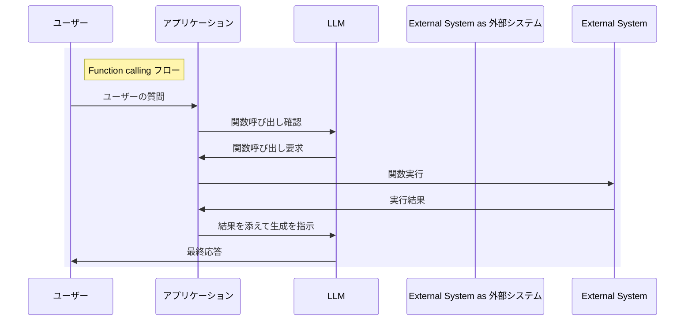
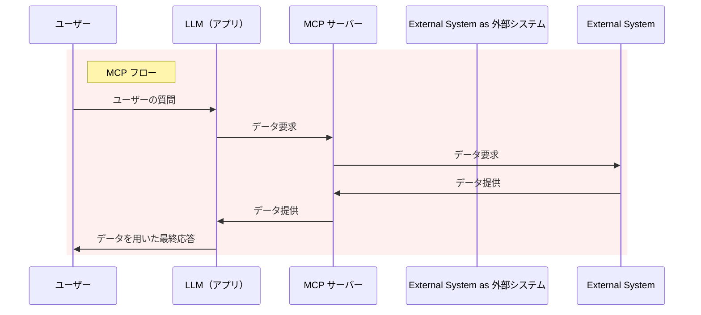

MCP を見ていて、Function calling の延長線上で考えられそうだったので、その方向でまとめてみました。また、プッシュ型・プル型のコンテキストでも考えてみます。

# 比較

Function calling と MCP は、LLM が外部呼び出しを要求するという点では共通していますが、その後のフローに違いがあります。

Function calling では、LLM は関数呼び出しのパラメータを生成するだけで、実際の関数実行はアプリケーション側で行う必要があります。関数実行の結果を使って最終的な応答を生成するための処理フローは、開発者が独自に実装する必要があります。

:::note info
アプリケーションが主体となって LLM を制御して、回答を生成します。
:::

一方、MCP ではプロトコルとして、LLM が MCP サーバーへデータを要求して、その結果を LLM が受け取り、それを情報源として LLM が最終的な応答を生成するまでの一連のフローが規定されています。これにより、開発者は個別にデータ取得後の処理フローを実装する必要がなく、MCP に準拠したシステムを構築するだけで、LLM が外部データを活用した応答生成まで一貫して行うことができます。

:::note info
LLM が主体となって回答を生成します。
:::

このように、MCP は Function calling よりも外部データの活用をより包括的に実現するプロトコルとなっています。

ユーザー視点では、Function calling はアプリケーションに隠蔽されるため意識する必要はありませんが、MCP はプラグインのようなものに見えます。

:::note info
細かく見れば、MCP でも LLM のクライアントアプリケーションが LLM と MCP サーバーの間に入っています。そのため Claude ではデスクトップアプリケーションが必要になります。上図では、LLM とそのクライアントアプリケーションを一体のものとして考えています。

以下の記事にはクライアントアプリケーションのフローが解説されています。実際には Function calling と同じようなフローとなっていることが分かります。
:::

https://laiso.hatenablog.com/entry/2025/01/11/200037

## 追記

クライアントアプリケーションの部分を作り込めば、Function calling から MCP サーバーが利用できるのでは？という発想ができます。それを実際に実装することで、GPT-4o で MCP サーバーを利用する記事があります。

https://qiita.com/sakasegawa/items/b091ad9931cea378099b

# プッシュ型・プル型

Function calling と MCP は、どちらも LLM が外部システムに対して何らかの要求を行うという点では同じですが、その要求の性質が異なります。

Function calling では、LLM が関数実行の要求を外部にプッシュします。「この関数をこのパラメータで実行してほしい」という具体的な実行要求を送り、その結果を受け取って処理するフローを開発者が作り込む必要があります。

一方、MCP では、LLM が外部システムから情報をプルする形になっています。必要な情報やコンテキストを「このような情報が欲しい」という形で要求し、その情報を直接取得して応答生成に活用します。このプル型のデータ取得は、プロトコルとして規定されているため、開発者は個別の処理フローを実装する必要がありません。

このように、LLM から見た操作の方向性という観点で、Function calling は「実行要求のプッシュ」、MCP は「情報のプル」という特徴の違いがあります。

# 関連記事

https://qiita.com/7shi/items/13d9c884a618feb89a94

https://qiita.com/7shi/items/0e31e10df92656aac207

https://qiita.com/7shi/items/3bf54f47a2d38c70d39b

# 参考

シーケンス図でフローが示されます。

https://modelcontextprotocol.io/quickstart

プッシュ型・プル型という分類は情報配信の形態としてよく使われますが、個人的には XML パーサーに馴染みがあります。

https://docs.microsoft.com/ja-jp/previous-versions/dotnet/netframework-1.1/sbw89de7(v=vs.71)

https://qiita.com/7shi/items/d8d3ab5371aa9dddcb3e

https://qiita.com/7shi/items/c7608db7a097ddd16be6
