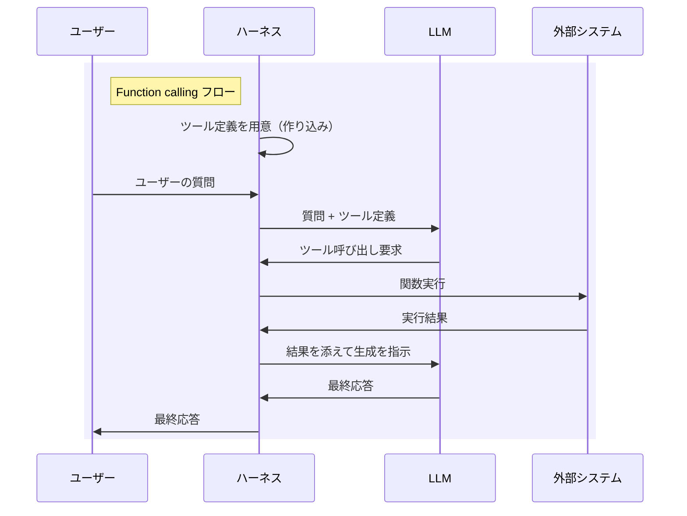
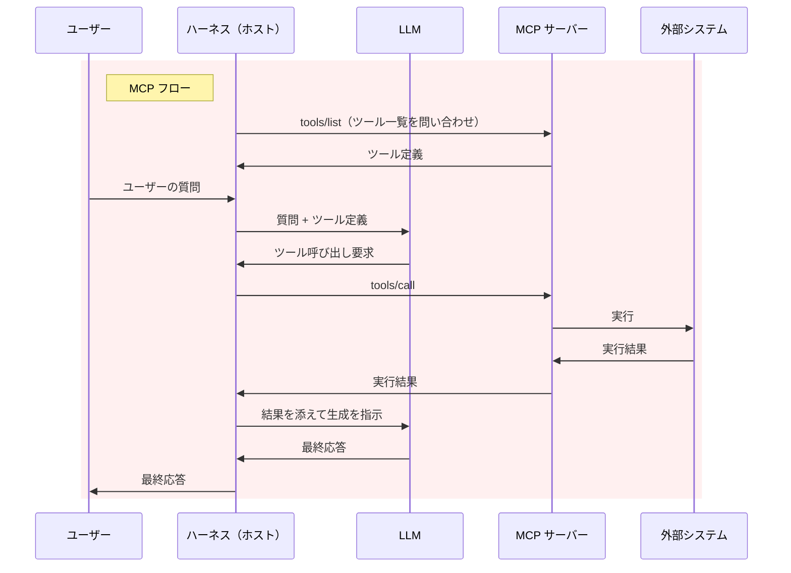

Function calling では、呼び出せるツールをあらかじめハーネス（アプリケーション）に埋め込んでおく必要がありました。MCP は、それを外に出してプラグインのように差し込めるようにした規格です。この視点で両者の関係を整理します。

更新履歴

- 2026/09/17 プラグインという視点で大幅に改訂、用語をハーネスに統一、リモートへの拡張の経緯を追加
- 2025/01/12 Function calling から MCP サーバーを利用する記事を追記

# Function calling: ツールはハーネスの中にある

Function calling では、LLM は関数呼び出しに必要な引数（パラメータ）を生成するだけで、実際の関数の実行は LLM の外側で行います。LLM を制御し、プロンプトの構築やツールの実行を担うこの枠組みを、現在では一般に**ハーネス**（あるいはアプリケーション）と呼びます。

呼び出せるツールの定義も、ハーネス側があらかじめ用意してプロンプト（API リクエスト）に含めます。

:::note info
ハーネスが主体となって LLM を制御し、回答を生成します。
:::

このように、ツールの定義も実装コードもハーネス内に直接組み込まれています。そのため、新しい連携先を増やすたびに、ハーネス自体のコードを改修して再ビルドや再デプロイを行う必要があります。

# MCP: ツールを外に出す

MCP では、ツールの定義と実装を「MCP サーバー」として外部に切り出します。ハーネス（MCP の仕様上は**ホスト**と呼びます）は MCP クライアント機能を備え、そのサーバーに接続します。

ここで重要なのは、MCP のプロトコルで通信するのは「ハーネス（ホスト）」と「MCP サーバー」の間であり、「LLM」と「MCP サーバー」の間ではないという点です。LLM 自身は MCP というプロトコルを一切扱いません。

ハーネスは接続時に `tools/list` でツール一覧を取得し、それを Function calling 用のツール定義に変換して LLM に渡します。そして LLM が返したツール呼び出し要求を、ハーネスが `tools/call` リクエストに変換して MCP サーバーへ中継します。

# LLM は MCP を喋らない

2 つの図を見比べると、LLM とやり取りする部分（`質問 + ツール定義` 以降）はまったく同じです。違いは、ツール定義をハーネス内部に抱えているか、外部のサーバーに問い合わせて取得しているかだけです。MCP の通信はハーネス側で完結しており、LLM には届きません。

つまり、両者は競合する選択肢ではありません。MCP は Function calling の仕組みの上に成り立っています。「ハーネスへの埋め込み」から「着脱可能なプラグイン」へとツールの管理方法が変わっただけであり、LLM から見た呼び出し方式そのものは変わっていないのです。

:::note info
プロトコルを直接解釈しないことと、MCP サーバーの存在を認識できないことは別です。ハーネスによってはツール名にサーバー名を含めたり（`mcp__サーバー名__ツール名` など）、システムプロンプトで接続中の MCP サーバーを説明したりします。LLM はそれを手掛かりに、どのサーバー由来のツールなのかを理解した上で適切に振る舞います。
:::

:::note info
Function calling に対応していない LLM でも、プロンプトで JSON を出力させるなどの方法でハーネスが呼び出し要求を取り出せれば、MCP サーバーは利用できます。MCP が前提としているのは「ツールを選んで呼び出させる」という機能であり、特定の API 仕様ではありません。
:::

逆に言えば、ハーネス側に MCP クライアント機能さえ実装されていれば、どのような LLM や環境からでも MCP サーバーを利用できます。背後にある基本構造が Function calling である以上、これは自然なことです。実際に GPT-4o で MCP サーバーを利用して、それを実証した記事もあります。

https://qiita.com/sakasegawa/items/b091ad9931cea378099b

# プラグイン化のために必要だったもの

LLM への渡し方が同じなら、わざわざ MCP という共通規格を使う意義はどこにあるのでしょうか。MCP が定めているのは、ツール定義が LLM に届くまでの「手前」の部分です。ツールをプラグイン機構として成立させるための共通仕様が規定されています。

- **発見 (Discovery)**: 接続時に `tools/list` で利用可能なツール一覧を問い合わせる。ハーネス本体を改修することなくツールの追加・削除ができる
- **転送 (Transport)**: 統一されたデータ形式（JSON-RPC 2.0）と通信経路を通じてやり取りする
- **能力交渉 (Capability Negotiation)**: 接続確立時に、クライアントとサーバーが互いにサポートしている機能を通知し合う

これらが標準化されたことで、1 つの MCP サーバーを複数のハーネスから共通して使い回せるようになりました。「ある環境用に作ったプラグインを、別のハーネスにもそのまま持って行って動かせる」という状態が実現したのです。

## MCP が提供するもの

MCP サーバーが提供する機能はツールだけではありません。利用を決定する主体（誰がトリガーするか）によって、主に次の 3 種類に分かれています。

| 種類 | トリガー（決定者） | 内容 |
|---|---|---|
| Tools | LLM | LLM が状況に応じて自発的に呼び出す。Function calling に変換される |
| Resources | ハーネス | ファイルや DB の内容など。ハーネスがコンテキスト（文脈）として LLM に提供する |
| Prompts | ユーザー | 定型プロンプト。ユーザーがスラッシュコマンドなどで明示的に選択して適用する |

このうち Function calling に変換されるのは Tools だけです。Resources や Prompts は LLM の自律的な判断を経由せず、ハーネスやユーザーが直接扱います。MCP は単なる関数呼び出しにとどまらず、「データや定型処理もまとめて提供できるプラグイン機構」と考えるとイメージしやすいでしょう。

## MCP サーバーからハーネスを呼ぶ

通常のツール呼び出しとは逆に、サーバー側からハーネスへ働きかける仕組み（逆方向の通信）も用意されています。

- **Sampling**: サーバーがハーネス側の LLM にテキスト生成などを依頼する仕組み。サーバー自身が個別に API キーを保持していなくても LLM を活用できる
- **Elicitation**: サーバーがハーネスを通じてユーザーへ追加入力や確認を求める仕組み

プラグイン側からハーネスの API を呼び返すような構成であり、これも拡張機能の設計パターンとして馴染みのある形です。

:::note info
Sampling は初版から規定されていますが、Elicitation は 2025-06-18 リビジョンで追加されました。
:::

# ローカルからリモートへ

この記事の初版は、MCP の仕様が公開された直後の 2024 年 11 月に書きました。当時の MCP は、プラグインの中でも「ローカル環境にインストールして動かすタイプ」のものでした。

初版（2024-11-05 リビジョン）で規定されていたトランスポートは次の 2 つです。

1. **stdio**: ハーネスがサーバーをサブプロセスとして起動し、標準入出力でやり取りする
2. **HTTP with SSE**: サーバーが独立したプロセスとして動作し、HTTP POST と Server-Sent Events (SSE) でやり取りする

HTTP 通信自体は最初から含まれていたものの、初版には認証・認可の規定がありませんでした。第三者が提供するリモートサービスに認証・認可なしで接続するわけにはいかないため、事実上はローカル専用でした。仕様書の注意書きでも、「ローカルで動かす際は `127.0.0.1` にバインドすること」「DNS リバインディング攻撃を防ぐために `Origin` ヘッダを検証すること」といったローカル運用を前提とした記述が並んでいました。実際、Claude デスクトップアプリも当初は設定ファイルにコマンドを記載してローカルのサブプロセスを起動する方式のみをサポートしていました。

この状況が大きく変わったのが、2025-03-26 リビジョンです。

1. OAuth 2.1 ベースの認証・認可フレームワークを追加
2. HTTP with SSE を Streamable HTTP に置き換え

認証・認可の仕組みが仕様として標準化されたことで、インターネット上のリモートサービスを安全にプラグインとして接続できるようになりました。続く 2025-06-18 リビジョンでは、MCP サーバーを OAuth のリソースサーバーとして明確に位置付け、悪意あるサーバーがアクセストークンを不正取得しないよう RFC 8707 (Resource Indicators) の利用がクライアント側に必須化されました。

「ローカルの実行ファイルを配布・実行するプラグイン」から、「URL を登録するだけで繋がるプラグイン」へ。これがこの 1 年あまりの流れです。プラグインである以上、第三者が用意した機能をハーネスの権限で動かすことになるため、認証・認可と信頼の扱いが仕様策定における重要な焦点となっています。

# 関連記事

Function calling の基本的な仕組みと動作フローを Google AI Studio で検証した記事です。

https://qiita.com/7shi/items/13d9c884a618feb89a94

Function calling のツール定義や構造化出力で用いられる JSON スキーマの設計方法を解説した記事です。

https://qiita.com/7shi/items/5a1add7189c45ae4a254

Windows の Claude デスクトップアプリから SQLite の MCP サーバーを利用した際の実践とトラブルシュートです。

https://qiita.com/7shi/items/0e31e10df92656aac207

MCP サーバーを自作し、処理遅延時の挙動の違いや MCP Inspector によるデバッグ方法を検証した記事です。

https://qiita.com/7shi/items/3bf54f47a2d38c70d39b

ハーネスと Function calling（ツールコール）の関係を実践的に解説した記事です。

https://zenn.dev/7shi/articles/20260102-toolcall-strout

# 参考

ハーネス（クライアント）の内部フローが丁寧に解説されています。実際には Function calling と同様のフローで動作していることがよく分かります。

https://laiso.hatenablog.com/entry/2025/01/11/200037

2025-03-26 リビジョンの変更点です。OAuth 2.1 による認証・認可と Streamable HTTP の導入に加え、ツールが読み取り専用か破壊的かを示すアノテーションが追加されました。

https://modelcontextprotocol.io/specification/2025-03-26/changelog

2025-06-18 リビジョンの変更点です。Elicitation と構造化されたツール出力が追加され、前リビジョンで導入された JSON-RPC のバッチングは削除されました。

https://modelcontextprotocol.io/specification/2025-06-18/changelog
