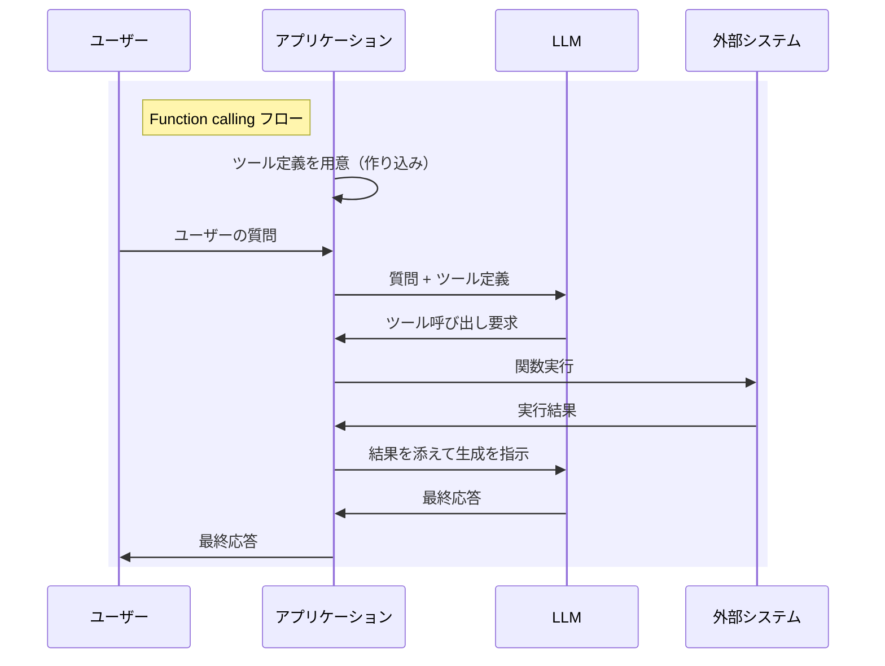
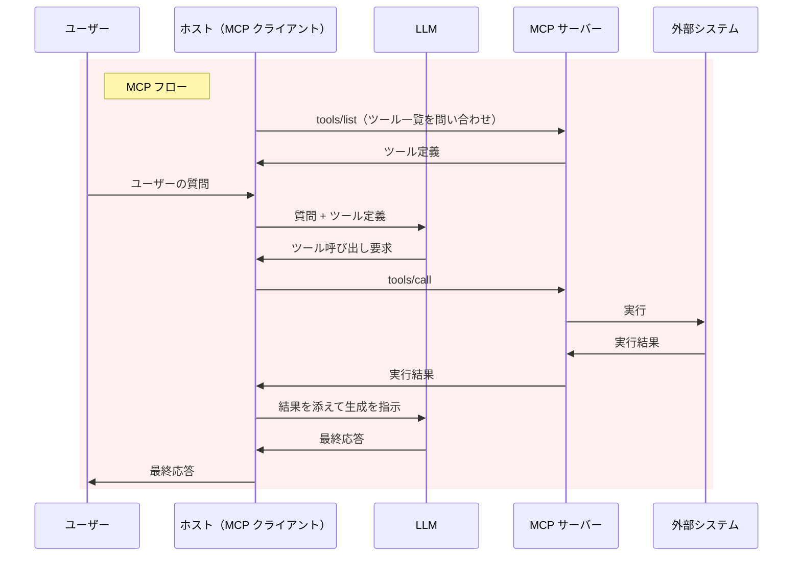

Function calling では、呼び出せるツールをアプリケーションにあらかじめ埋め込んでおく必要がありました。MCP は、それを外に出してプラグインのように差し込めるようにした規格です。

この視点で両者の関係を整理します。

更新履歴

- 2026/09/16 プラグインという視点で大幅に改訂、リモートへの拡張の経緯を追加
- 2025/01/12 Function calling から MCP サーバーを利用する記事を追記

# Function calling: ツールはアプリの中にある

Function calling では、LLM は関数呼び出しのパラメータを生成するだけで、実際の関数実行はアプリケーション側で行います。呼び出せる関数の定義も、アプリケーションがあらかじめ用意してプロンプトに添えます。

:::note info
アプリケーションが主体となって LLM を制御して、回答を生成します。
:::

ツールの定義も実装も、アプリケーションの中に埋め込まれています。連携先を増やすには、そのつどアプリケーションに手を入れて作り直すことになります。

# MCP: ツールを外に出す

MCP では、ツールの定義と実装を MCP サーバーとして切り出します。アプリケーション（**ホスト**と呼びます）は MCP クライアントを内蔵して、そのサーバーに接続します。

ここで重要なのは、MCP がやり取りされるのはホストと MCP サーバーの間であり、LLM と MCP サーバーの間ではないという点です。LLM は MCP というプロトコルを一切扱いません。

ホストは接続時に `tools/list` でツール一覧を取得して、それを Function calling のツール定義に変換して LLM に渡します。LLM が返したツール呼び出し要求は、ホストが `tools/call` に変換して MCP サーバーへ中継します。

# LLM は MCP を喋らない

2 つの図を見比べると、LLM と接する部分（`質問 + ツール定義` 以降）はまったく同じです。違いは、そのツール定義をアプリケーションが自前で抱えているか、外部のサーバーに問い合わせて得ているかだけです。MCP の通信はホストで完結していて、LLM には届きません。

つまり両者は競合する選択肢ではありません。MCP は Function calling の上に載っています。埋め込みから着脱へ、という違いであって、呼び出し方式は変わっていません。

:::note info
プロトコルを喋らないことと、存在を知らないことは別です。ホストによってはツール名にサーバー名を含めたり（`mcp__サーバー名__ツール名` など）、システムプロンプトで接続中の MCP サーバーを説明したりします。LLM はそれを手掛かりに、どのサーバー由来のツールなのかを認識した上で振る舞います。
:::

:::note info
Function calling に対応していない LLM でも、プロンプトで JSON を出力させるなどの方法でホストが呼び出し要求を取り出せれば、MCP サーバーは利用できます。MCP が前提としているのは「ツールを選んで呼び出させる」という機能であり、特定の API 仕様ではありません。
:::

逆に言えば、クライアント側さえ実装すれば、どんなアプリケーションからでも MCP サーバーは利用できます。下回りが Function calling である以上、これは当然の帰結です。実際に GPT-4o で MCP サーバーを利用して、それを実証した記事があります。

https://qiita.com/sakasegawa/items/b091ad9931cea378099b

# プラグイン化のために必要だったもの

LLM への渡し方が同じなら、MCP には何の意味があるのかという話になります。MCP が定めているのは、ツール定義が LLM に届くまでの手前の部分です。プラグイン機構として成立させるために必要なものが規定されています。

- **発見**: 接続時に `tools/list` で何が使えるかを問い合わせる。アプリケーションを作り直さずにツールを増減できる
- **転送**: 決まった形式（JSON-RPC 2.0）で、決まった経路を通してやり取りする
- **能力交渉**: 接続を確立する際に、クライアントとサーバーが互いに何をサポートするかを伝え合う

これらが共通化されたことで、1 つの MCP サーバーを複数のホストから使い回せるようになりました。プラグインを別のアプリケーションに持って行っても動く、という状態です。

## プラグインが提供するもの

MCP サーバーが提供するのはツールだけではありません。誰が使うかを決めるかによって 3 種類に分かれています。

| 種類 | 決めるのは | 内容 |
|---|---|---|
| Tools | LLM | LLM が自分の判断で呼び出す。Function calling に変換される |
| Resources | ホスト | ファイルや DB の内容など。ホストがコンテキストに含める |
| Prompts | ユーザー | 定型プロンプト。ユーザーがスラッシュコマンドなどで明示的に選ぶ |

Function calling に変換されるのは Tools だけです。Resources と Prompts は LLM の判断を経由せず、ホストが直接扱います。プラグインがコマンドだけでなくデータや定型処理も提供する、と考えると分かりやすいと思います。

## プラグインからホストを呼ぶ

逆向きの機能もあります。サーバーからホストへ働きかける仕組みです。

- **Sampling**: サーバーがホストの LLM に生成を依頼する。サーバー自身が API キーを持たずに LLM を使える
- **Elicitation**: サーバーがユーザーへ追加入力を求める

プラグインがホストの API を呼び返す構図で、これもプラグイン機構としては馴染みのある形です。

:::note info
Sampling は初版から規定されていますが、Elicitation は 2025-06-18 リビジョンで追加されました。
:::

# ローカルからリモートへ

この記事の初版は、MCP の仕様が公開された直後の 2024 年 11 月に書きました。当時の MCP は、プラグインの中でもローカルにインストールするタイプのものでした。

初版（2024-11-05 リビジョン）のトランスポートは 2 つです。

1. **stdio**: クライアントがサーバーをサブプロセスとして起動して、標準入出力でやり取りする
2. **HTTP with SSE**: サーバーが独立したプロセスとして動き、HTTP POST と Server-Sent Events でやり取りする

HTTP が最初から含まれてはいるものの、初版には認可の規定がありませんでした。第三者の提供するリモートサービスに認証なしで繋ぐわけにはいかないため、事実上はローカル用です。仕様の注意書きも、ローカルで動かす際は `127.0.0.1` にバインドせよ、DNS リバインディング攻撃を防ぐため `Origin` ヘッダを検証せよ、とローカル運用を前提にした内容でした。実際、Claude デスクトップアプリも当初は設定ファイルにコマンドを書いてサブプロセスを起動する形だけに対応していました。

これが変わったのが 2025-03-26 リビジョンです。

1. OAuth 2.1 ベースの認可フレームワークを追加
2. HTTP with SSE を Streamable HTTP に置き換え

認可が仕様に取り込まれたことで、リモートのサービスをプラグインとして繋げるようになりました。続く 2025-06-18 リビジョンでは、MCP サーバーを OAuth のリソースサーバーとして位置付け、悪意あるサーバーがアクセストークンを奪わないよう RFC 8707 の Resource Indicators をクライアントに必須としています。

ローカルの実行ファイルを配布するプラグインから、URL を登録するだけで繋がるプラグインへ、というのがこの 1 年あまりの流れです。プラグインである以上、他人の用意したものをホストの権限で動かすことになるため、認可と信頼の扱いが仕様の主戦場になっています。

# 関連記事

https://qiita.com/7shi/items/13d9c884a618feb89a94

https://qiita.com/7shi/items/0e31e10df92656aac207

https://qiita.com/7shi/items/3bf54f47a2d38c70d39b

https://zenn.dev/7shi/articles/20260102-toolcall-strout

# 参考

クライアントアプリケーションのフローが解説されています。実際には Function calling と同じようなフローとなっていることが分かります。

https://laiso.hatenablog.com/entry/2025/01/11/200037

2025-03-26 リビジョンの変更点です。OAuth 2.1 による認可と Streamable HTTP の導入に加え、ツールが読み取り専用か破壊的かを示すアノテーションが追加されました。

https://modelcontextprotocol.io/specification/2025-03-26/changelog

2025-06-18 リビジョンの変更点です。Elicitation と構造化されたツール出力が追加され、前リビジョンで入った JSON-RPC のバッチングは削除されました。

https://modelcontextprotocol.io/specification/2025-06-18/changelog
