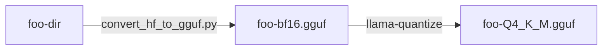

Python の Transformers ライブラリで使用される safetensors 形式から、llama.cpp で使用される GGUF 形式への変換と量子化についてのメモです。

# clone

Hugging Face にある git リポジトリから clone すると、変換には使わないファイルも含まれます。ダウンロードサイズが巨大になって、帯域やディスクを圧迫します。

必要なファイルだけ取得するには、ダウンロードをライブラリに任せるのが簡単です。

モデルのページに Python のサンプルが載っていれば、`from_pretrained` まで実行すれば良いです。

例として次のモデルを使用します。

https://huggingface.co/HODACHI/Borea-Phi-3.5-mini-Instruct-Coding

サンプルの当該箇所を抜粋します。

```py:抜粋
from transformers import AutoModelForCausalLM, AutoTokenizer, pipeline

model = AutoModelForCausalLM.from_pretrained(
    "HODACHI/Borea-Phi-3.5-mini-Instruct-Coding", 
    #device_map="cuda", 
    torch_dtype="auto", 
    trust_remote_code=True, 
)
tokenizer = AutoTokenizer.from_pretrained("HODACHI/Borea-Phi-3.5-mini-Instruct-Coding")
```

:::note warn
* `model` と `tokenizer` で別々にダウンロードが行われます。片方だけでは完全に動作するファイル一式が得られません。
* ダウンロードだけで、推論は行わないため、CUDA の設定はコメントアウトしています。
:::

デフォルトのダウンロード先はホームディレクトリの .cache/huggingface/hub/ 以下になります。環境変数 `HUGGINGFACE_HUB_CACHE` により変更できます。

```text:例 (Windows)
set HUGGINGFACE_HUB_CACHE=D:\llm\.cache
```

# 変換

最終的に Q4_K_M などで量子化する場合、変換は 2 段階で行います。

1. BFloat16 の GGUF に変換
2. 量子化

それぞれ llama.cpp に含まれるツールを使用します。

https://github.com/ggerganov/llama.cpp

1. convert_hf_to_gguf.py  
   * `pip install -r requirements.txt` で Python のライブラリをインストール
   * llama.cpp のバイナリに依存しないため、ビルド不要
2. llama-quantize
   * 要ビルド

:::note warn
convert_hf_to_gguf.py は Q8_0 への変換をサポートしています。しかし Q4_K_M などが目的であれば、2 段階の量子化による劣化を避けるため、まずは BFloat16 にしておくのが無難です。
:::

それぞれのツールの使い方は、引数なしで実行すれば確認できます。例を示します。

```sh:変換例
python convert_hf_to_gguf.py --outfile foo-bf16.gguf --outtype bf16 foo-dir
./llama-quantize foo-bf16.gguf foo-Q4_K_M.gguf Q4_K_M
```


量子化形式の選択については、以下の記事が参考になります。

https://sc-bakushu.hatenablog.com/entry/2024/02/26/062547

# fbgemm.dll

Windows で torch-2.4.0 が fbgemm.dll でエラーになる問題が発生します。私の環境では VC_redist.X64 をインストールして、バージョンを 2.3.1 に下げることで動作しました。

原因が 2 種類（libomp140 と VC_redist）あるため、情報がやや錯綜しています。

2.4.0 が必要な場合、libomp140.x86_64.dll を手動で追加すれば回避できます。

https://note.com/mayu_hiraizumi/n/n3db157e3c801

2.3.1 は、VC_redist.X64 のインストールで解決すると思われます。

https://knowledge-oasis.net/fix/fix-winerror-126/

次の記事では 2.1.2 まで下げていますが、VC_redist.X64 をインストールすれば、そこまで下げなくても良さそうです。

https://qiita.com/UKI_datascience/items/2626dba5bba8f51fcb85

# Ollama

Ollama だけでも変換ができるようです。

https://note.com/lucas_san/n/n02a3365ccc7c
