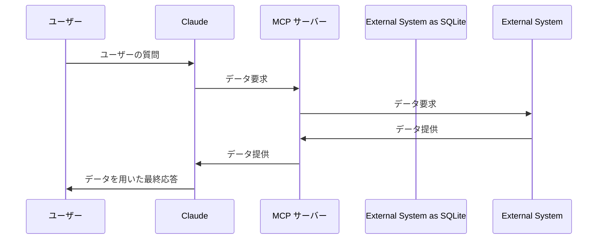

Windows で SQLite の MCP サーバーを試したところ、文字コードでハマりました。トラブル事例と解決策を書きます。

:::note info
【追記 2025.01.31】
SQLite の MCP サーバーに限定して修正されました。👉[PR #378](https://github.com/modelcontextprotocol/servers/pull/378)
共通部分の修正ではないため、他の Python で書かれた MCP サーバーで日本語を扱うには、依然として環境変数 `PYTHONIOENCODING` の設定が必要です。
:::

# MCP

Model Context Protocol (MCP) は LLM からの外部呼出しに関するプロトコルです。MCP をサポートする LLM クライアントに、MCP サーバーをプラグインのように登録すれば、LLM から外部の機能が利用できるようになります。

https://www.anthropic.com/news/model-context-protocol

本記事では、Windows の Claude デスクトップアプリから MCP 経由で SQLite を操作します。



# 設定

Claude デスクトップアプリをダウンロードしてインストールします。

https://claude.ai/download

アプリを起動してログインします。

左上のメニューから開発者モードを有効にします。


メニューから設定を開きます。


Developer を選択します。


[Get Started] をクリックします。


以下のサイトが開かれます。

https://modelcontextprotocol.io/quickstart

このサイトには SQLite でのテストの手順が載っています。本記事ではこれをベースに説明します。

コマンドプロンプトから、WinGet で必要なツール類をインストールします。

```bat
winget install --id=astral-sh.uv -e
winget install git.git sqlite.sqlite
```

Claude の設定に戻って、[Edit Config] をクリックします。


フォルダが開かれて claude_desktop_config.json が選択されるため、メモ帳などのエディタで開いて、以下の内容を入力して保存します。

```json:claude_desktop_config.json
{
  "mcpServers": {
    "sqlite": {
      "command": "uvx",
      "args": [
        "mcp-server-sqlite",
        "--db-path",
        "C:\\Users\\YOUR_USERNAME\\test.db"
      ]
    }
  }
}
```

:::note warn
指定した SQLite の DB を参照します。`test.db` のパスは適宜書き換えてください。
:::

説明では色々と書かれていますが、本記事ではばっさり省略します。SQLite の DB は作らなくても、自動で作成されます。

タスクトレイからウニのようなアイコンの Claude アプリを右クリックして Quit します。


:::note warn
設定変更のためにはタスクトレイから終了する必要があります。単にアプリのウィンドウを閉じただけだと、常駐して残っているため、設定変更が反映されません。
:::

~~Claude アプリを再起動すれば、アプリとともに真っ黒なコマンドプロンプトのウィンドウが開きます。特に何も表示されませんが、これが SQLite の MCP サーバーのため、閉じてはいけません。~~（アップデートにより非表示になりました）

設定ファイルで指定したパスに DB ファイルが作られていることを確認してください。

# 失敗するケース

サンプル通りの設定だと、日本語が含まれるデータが正常に処理されずに失敗します。

:::note info
同じ問題に遭遇して解決策を検索する場合を想定して、敢えて失敗するケースを書きます。
:::

## テーブルの作成

Claude で新規チャットを開いて、テーブルの作成を指示します。

```text
SQLiteで英語の単語帳を作ります。英語と日本語のペアを登録するテーブルを作成してください。
```

MCP サーバーの呼び出しが行われると、確認を求められるので許可します。


:::note info
以後、新しい種類の呼び出しが行われるたびに確認を求められますが、許可してください。

Windows ファイアーウォールや、Deno の挙動に似ています。
:::

以下のような SQL が発行されます。

```sql
CREATE TABLE words (
    id INTEGER PRIMARY KEY AUTOINCREMENT,
    word TEXT NOT NULL,
    meaning TEXT NOT NULL,
    note TEXT,
    created_at TIMESTAMP DEFAULT CURRENT_TIMESTAMP
);
```

:::note warn
詳細を指定していないため、必ずしも毎回同じとは限りません。最低限必要なのは `word` と `meaning` に相当するカラムです。
:::

## 単語登録に失敗

単語の登録を指示します。

```text
appleを登録してください。
```

以下のような SQL が発行されます。

```sql
INSERT INTO words (word, meaning) VALUES ('apple', 'りんご');
```

しばらく待つと、MCP サーバーのウィンドウが閉じて、さらに待つと Claude アプリ側でタイムアウトになります。


Claude は再試行を試みますが、MCP サーバーが落ちているため失敗します。

## 手動登録

コマンドプロンプトから DB の状況を確認して、手動でデータを追加します。

```sql
>sqlite3 test.db
SQLite version 3.47.0 2024-10-21 16:30:22
Enter ".help" for usage hints.
sqlite> SELECT * FROM words;
sqlite> INSERT INTO words (word, meaning) VALUES ('apple', 'りんご');
sqlite> SELECT * FROM words;
1|apple|りんご||2024-11-29 16:38:52
sqlite> .q
```

:::note warn
DB ファイルのパスは、設定に応じて適宜書き換えてください。
:::

## データ確認

Claude アプリをタスクトレイから終了して、再起動します。

先ほどのチャットの続きで、データの確認を指示します。

```text
読み込みを試してください。
```

> テーブルの内容を確認してみます。
> 
> View Result from read-query from sqlite (local)
> ```
> {
>   `query`: `SELECT * FROM words;`
> }
> [{'id': 1, 'word': 'apple', 'meaning': '���', 'note': None, 'created_at': '2024-11-29 12:51:53'}]
> ```
> データが登録されているようですが、日本語の文字化けが発生しています。このため、文字エンコーディングの問題がありそうです。

文字化けが指摘されました。Windows の日本語環境では Python のデフォルトは CP932 (Shift JIS) のため、UTF-8 を想定した Claude との間で不具合が起きているようです。

# 文字コードを指定

設定ファイルで Python に環境変数で UTF-8 を指定します。

```json:claude_desktop_config.json
{
  "mcpServers": {
    "sqlite": {
      "command": "uvx",
      "args": [
        "mcp-server-sqlite",
        "--db-path",
        "C:\\Users\\YOUR_USERNAME\\test.db"
      ],
      "env": {
        "PYTHONIOENCODING": "utf-8"
      }
    }
  }
}
```

Claude アプリをタスクトレイから終了して、再起動します。

先ほどのチャットの続きで、再度、データの確認を指示します。

```text
読み込みを試してください。
```

> テーブルの内容を確認します。
> 
> View Result from read-query from sqlite (local)
> ```
> {
>   `query`: `SELECT * FROM words;`
> }
> [{'id': 1, 'word': 'apple', 'meaning': 'りんご', 'note': None, 'created_at': '2024-11-29 12:51:53'}]
> ```
> データが正しく読み取れました。

文字コードを指定したことで、今度は正常に読み取れました。

単語の追加も問題なく行えます。

```text
基本的な単語をいくつか登録してください。
```

以下のような SQL が発行されて、正常に登録されます。

```sql
INSERT INTO words (word, meaning) VALUES 
    ('book', '本'),
    ('cat', '猫'),
    ('dog', '犬'),
    ('house', '家'),
    ('water', '水');
```

このように、MCP の SQLite サーバーを利用するには、Windows では文字コードの指定が不可欠です。

# Issue

文字コードは Windows での Python の仕様のため、UTF-8 を明示的に指定するのは仕方ない面があります。ただ、MCP サーバーが落ちてしまうのは問題があるため、Issue で要望を送っておきました。

https://github.com/modelcontextprotocol/servers/issues/124

今回の調査で Python による MCP サーバーの挙動は何となく分かって来たので、自作する場合のイメージが湧いて来ました。

# 調査方法

この問題を調査するにあたって、以下の手法で既存の Issues を確認しました。

https://qiita.com/7shi/items/b17cb8d96ae0328bee7e

NotebookLM では解決策が引っ掛かりませんでしたが、コメントを含めて Claude に読み込ませた所（👉[参考](https://x.com/7shi/status/1862447745912775012)）、別の MCP サーバーで文字コードの対処を行っていることが分かりました。

https://github.com/modelcontextprotocol/servers/issues/65#issuecomment-2506967950

:::note info
これに限らず、Issue の議論ではノウハウが飛び交っているため、色々なことが分かります。LLM を経由することで、英語を直接読まなくても大まかな調査ができるのは嬉しいです。
:::

# 関連記事

https://qiita.com/7shi/items/e27866ce51c6b9a0f605

https://qiita.com/7shi/items/3bf54f47a2d38c70d39b

# 参考

https://six-loganberry-ba7.notion.site/24-11-29-Windows-Claude-MCP-14df7e7600e9800baad5c3611be9afa7

https://qiita.com/Maki-HamarukiLab/items/298d81c1ba686abb3db4
