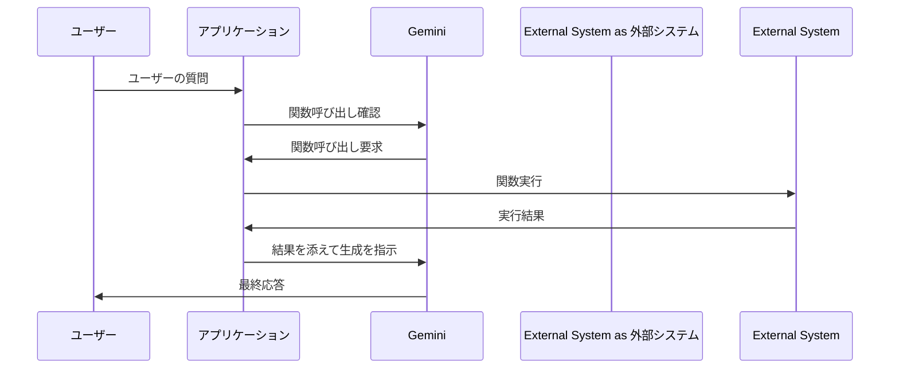

Google AI Studio で Gemini の Function calling を試したので、簡単にまとめます。

# 概要

Function calling は、その名前から受ける印象とは異なり、Gemini が関数を直接呼び出す機能ではありません。Gemini は、事前に定義された呼び出し条件に基づき、プロンプトの内容を解析します。プロンプトが指定条件に合致した場合、Gemini は条件に合致する部分をプロンプトから引数として抽出し、関数呼び出し要求を JSON 形式で返します。JSON には、関数名と抽出された引数が含まれます。

つまり、Function calling はプロンプトの内容を解析し、特定の関数を実行するための要求を出力する機能です。実際の関数の呼び出しや実行は、Gemini の外側、例えばクライアント側のアプリケーションで行います。

フローの例を示します。アプリケーションが主体となって LLM を制御して、回答を生成します。



この仕組みにはいくつかの利点があります。

* **柔軟な実装:** Gemini は関数の呼び出し自体を行わないため、関数の具体的な実装はクライアント側で自由に決定できます。例えば、ローカルの Python スクリプトを実行したり、外部 API を呼び出したり、データベースにクエリを送信したりすることが可能です。
* **セキュリティ:** Gemini が直接外部システムにアクセスする必要がないため、セキュリティリスクを低減できます。
* **保守性:** 関数の追加や変更はクライアント側で行うため、Gemini のモデル自体を更新する必要がなく、保守が容易になります。
* **拡張性:** 様々な種類の関数やツールと連携させることで、Gemini の機能を拡張できます。

# 使用手順

Google AI Studio での使用手順を説明します。

まず新規チャットを作成します。

System Instructions に以下を記入します。

```
Function calling の結果を JSON で返してください。
```

画面右側の Tools にある Function calling を有効にして、Edit functions をクリックします。


関数を定義する画面が現れます。Try an example をクリックして、提示された `getWeather` 関数を使用します。Save をクリックします。


プロンプトに「東京の天気は？」と入力すれば、以下のような JSON が返されます。

```json
{
  "name": "getWeather",
  "args": {
    "city": "東京"
  }
}
```

このようなやり取りをスクリプトから行うことで、取得した JSON に基づいた処理を行うことができます。

## 引数の追加

日時を指定して天気を取得する場合、関数の定義画面を開いて `date` という Property（引数に相当）を追加します。

こうすることで、「明日の東京の天気は？」といった質問に対応できるようになります。

```json
{
  "name": "getWeather",
  "args": {
    "date": "明日",
    "city": "東京"
  }
}
```

# まとめ

Function calling は、Gemini と外部システムを連携させる強力な機能です。これにより Gemini は自然言語理解に集中しつつ、必要に応じてタスクを外部システムに委譲することで、拡張性や専門性を向上させることができます。

また、Function calling はプロンプトの内容を解析するための手段としても利用できます。例えば地名の詳細を取得するための関数を登録することで、プロンプトに含まれる地名を抽出することができます。

# 関連記事

https://qiita.com/7shi/items/e27866ce51c6b9a0f605
