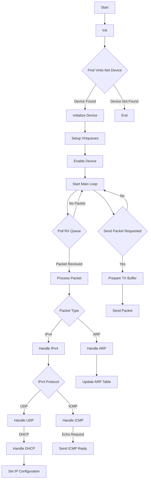

[hikalium さん](https://x.com/hikalium)が開発された liumOS の virtio-net ドライバの概要をまとめ、仕様書の対応箇所を示します。virtio-net ドライバの実装にあたり、仕様書のどのような個所を参照するかを調査するのが目的のため、実装の詳細には踏み込みません。

ドライバ：

- https://github.com/hikalium/liumos/blob/main/src/virtio_net.h
- https://github.com/hikalium/liumos/blob/main/src/virtio_net.cc

仕様書：

- https://docs.oasis-open.org/virtio/virtio/v1.1/csprd01/virtio-v1.1-csprd01.html

:::note info
最新版は 1.3 ですが、コードが書かれた時期から 1.1 が参照されているようです。
:::

本記事は、Claude 3.5 Sonnet の出力をベースに編集しています。

# 特徴

主な特徴は以下の通りです:

1. `Virtio::Net` クラスがメインのドライバクラスとして実装
2. PCI バスを通じて virtio-net デバイスを検出し初期化
3. 送受信用の仮想キュー (Virtqueue) を使用してパケットを送受信
4. ARP, ICMP, UDP などの基本的なネットワークプロトコルをサポート
5. DHCP を使用して動的に IP アドレスを取得
6. ネットワークパケットの処理を行うためのハンドラ関数を実装
7. 初期化プロセスで MAC アドレスの取得やバッファの設定など
8. デバイスのステータスや機能の設定、I/O ポートを介したデバイスとの通信など

このドライバは、virtio-net デバイスを使用して基本的なネットワーク機能を liumOS に提供することを目的としています。低レベルのデバイス操作からプロトコル処理までが実装されています。

# 処理のフロー



このフローチャートは、Virtio-Net ドライバの主要な処理フローを示しています：

1. ドライバの初期化から始まり、Virtio-Net デバイスを探索
2. デバイスが見つかったら、初期化して仮想キュー (Virtqueues) をセットアップ
3. デバイスを有効にした後、メインループに入る
4. メインループでは、受信キュー (RX Queue) をポーリングし、パケットが届いているかチェック
5. パケットを受信したら、そのタイプ（ARP, IPv4など）に応じて適切に処理
6. IPv4 パケットの場合、さらに ICMP や UDP（DHCP を含む）などのプロトコルに応じて処理
7. 必要に応じて、ARP テーブルの更新、ICMP リプライの送信、IP アドレス設定などを実行
8. パケット送信が要求された場合、送信バッファを準備してパケットを送信
9. これらの処理を継続的に繰り返す

# クラスと関数

| クラス/関数名 | 説明 |
|---------------|------|
| `Virtio::Net` | virtio-net デバイスを制御するメインクラス |
| `Virtio::Net::Virtqueue` | 仮想キューを管理するクラス |
| `Virtio::Net::Init()` | デバイスの初期化を行う関数 |
| `Virtio::Net::ProcessPacket()` | 受信したパケットを処理する関数 |
| `Virtio::Net::PollRXQueue()` | 受信キューをポーリングする関数 |
| `Virtio::Net::SendPacket()` | パケットを送信する関数 |
| `Virtio::Net::GetNextTXPacketBuf()` | 次の送信パケットバッファを取得する関数 |
| `FindVirtioNet()` | PCI バスから virtio-net デバイスを探す関数 |
| `ARPPacketHandler()` | ARP パケットを処理するハンドラ関数 |
| `ICMPPacketHandler()` | ICMP パケットを処理するハンドラ関数 |
| `UDPPacketHandler()` | UDP パケットを処理するハンドラ関数 |
| `IPv4PacketHandler()` | IPv4 パケットを処理するハンドラ関数 |
| `SendICMPEchoReply()` | ICMP エコー要求に対する返信を送信する関数 |

これらのクラスと関数は、virtio-net デバイスの初期化、パケットの送受信、各種ネットワークプロトコルの処理など、ドライバの主要な機能を実装しています。

# 仕様書の参照

コード内で参照されている仕様書を抜粋し、一覧表にまとめます。また、どの関数や部分で言及されているかも記載します。

| 参照箇所 | 仕様書 |
| ---- | ---- |
| `Net::PacketBufHeader` | Virtio Specification 5.1.6 Device Operation |
| virtio_net.cc | Virtio Specification 2.1 Device Status Field |
| `UDPPacketHandler()` | RFC 2131 - Dynamic Host Configuration Protocol |
| `Net::Init()` | PCI Specification 6.7. Capabilities List |
| `Net::Init()` | Virtio Specification 4.1.4 Virtio Structure PCI Capabilities |
| `Net::Init()` | [VIRTIO DRIVER IMPLEMENTATION](http://www.dumais.io/index.php?article=aca38a9a2b065b24dfa1dee728062a12) |
| `Net::Init()` | Virtio Specification 3.1.1 Driver Requirements: Device Initialization |
| `Net::Init()` | Virtio Specification 5.1.4.2 Driver Requirements: Device configuration layout |
| `Net::Init()` | Virtio Specification 5.1.5 Device Initialization |
| `Net::Init()` | Virtio Specification 4.1.5.1.3 Virtqueue Configuration |

ソースコードから仕様書が参照されている該当箇所を抜粋して、仕様書の抜粋の翻訳を添えます。（Virtio に関連する仕様のみ）

## `Net::PacketBufHeader`

### 5.1.6 Device Operation

```cpp
struct PacketBufHeader {
  // virtio: 5.1.6 Device Operation
  uint8_t flags;
  uint8_t gso_type;
  uint16_t header_length;
  uint16_t gso_size;
  uint16_t csum_start;
  uint16_t csum_offset;
  //
  static constexpr uint8_t kFlagNeedsChecksum = 1;
  static constexpr uint8_t kGSOTypeNone = 0;
};
```

パケットは transmitq1 ～ transmitqN に配置して送信され、受信パケット用のバッファは receiveq1 ～ receiveqN に配置されます。いずれの場合も、パケット自体はヘッダに先行されます。

```c:仕様書
struct virtio_net_hdr {   
#define VIRTIO_NET_HDR_F_NEEDS_CSUM    1   
#define VIRTIO_NET_HDR_F_DATA_VALID    2   
#define VIRTIO_NET_HDR_F_RSC_INFO      4   
		u8 flags;   
#define VIRTIO_NET_HDR_GSO_NONE        0   
#define VIRTIO_NET_HDR_GSO_TCPV4       1   
#define VIRTIO_NET_HDR_GSO_UDP         3   
#define VIRTIO_NET_HDR_GSO_TCPV6       4   
#define VIRTIO_NET_HDR_GSO_ECN      0x80   
		u8 gso_type;   
		le16 hdr_len;   
		le16 gso_size;   
		le16 csum_start;   
		le16 csum_offset;   
		le16 num_buffers;   
};
```

controlq は、フィルタリングなどのデバイスの機能制御に使用されます。

## virtio_net.cc

### 2.1 Device Status Field

```cpp
// 2.1 Device Status Field
constexpr static uint8_t kDeviceStatusAcknowledge = 1;
constexpr static uint8_t kDeviceStatusDriver = 2;
constexpr static uint8_t kDeviceStatusDriverOK = 4;
constexpr static uint8_t kDeviceStatusFeaturesOK = 8;
// constexpr static uint8_t kDeviceStatusDeviceNeedsReset = 64;
// constexpr static uint8_t kDeviceStatusFailed = 128;
```

- `ACKNOWLEDGE` (1): ゲスト OS がデバイスを検出し、有効な virtio デバイスとして認識したことを示す。
- `DRIVER` (2): ゲスト OS がデバイスの駆動方法を知っていることを示す。 注記:このビットが設定されるまでに、大幅な（または無限の）遅延が発生する可能性がある。 例えば、Linux では、ドライバはロード可能なモジュールである場合がある。
- `FAILED` (128): ゲストに何らかの問題が発生し、デバイスを放棄したことを示す。これは内部エラーである可能性や、ドライバが何らかの理由でデバイスを好まない可能性もある。あるいは、デバイス操作中の致命的なエラーである可能性もある。
- `FEATURES_OK` (8): ドライバが理解するすべての機能が認識され、機能ネゴシエーションが完了したことを示す。
- `DRIVER_OK` (4): ドライバがセットアップされ、デバイスを駆動する準備ができていることを示す。
- `DEVICE_NEEDS_RESET` (64): デバイスが回復不可能なエラーを経験したことを示す。

## `Net::Init()`

### 4.1.4 Virtio Structure PCI Capabilities

```cpp
// 4.1.4 Virtio Structure PCI Capabilities
uint8_t cap_ofs = static_cast<uint8_t>(PCI::ReadConfigRegister32(dev_, 0x34));
for (; cap_ofs; cap_ofs = PCI::ReadConfigRegister8(dev_, cap_ofs + 1)) {
  uint8_t cap_id = PCI::ReadConfigRegister8(dev_, cap_ofs);
  if (cap_id != 0x09 /* vendor-specific capability */)
    continue;
  uint8_t cap_type = PCI::ReadConfigRegister8(dev_, cap_ofs + 3);
  if (cap_type != 0x01)
    continue;
}
```

各構造体の位置は、デバイスの PCI 構成空間内の機能リストにあるベンダー固有の PCI 機能を使用して指定されます。この virtio 構造体の機能はリトルエンディアン形式を使用します。特に記載がない限り、すべてのフィールドはドライバーに対して読み取り専用です。

```c:仕様書
struct virtio_pci_cap {   
        u8 cap_vndr;    /* Generic PCI field: PCI_CAP_ID_VNDR */   
        u8 cap_next;    /* Generic PCI field: next ptr. */   
        u8 cap_len;     /* Generic PCI field: capability length */   
        u8 cfg_type;    /* Identifies the structure. */   
        u8 bar;         /* Where to find it. */   
        u8 padding[3];  /* Pad to full dword. */   
        le32 offset;    /* Offset within bar. */   
        le32 length;    /* Length of the structure, in bytes. */   
};
```

- `cap_vndr`: `0x09`; ベンダー固有の機能を識別
- `cfg_type`: 構成を識別

```c:仕様書
/* Common configuration */
#define VIRTIO_PCI_CAP_COMMON_CFG 1
```

### 3.1.1 Driver Requirements: Device Initialization

```cpp
// 3.1.1 Driver Requirements: Device Initialization
WriteDeviceStatus(ReadDeviceStatus() | kDeviceStatusAcknowledge);
WriteDeviceStatus(ReadDeviceStatus() | kDeviceStatusDriver);
```

ドライバは、デバイスを初期化するために、以下の手順に従う必要があります。

1. デバイスをリセット
2. ACKNOWLEDGE ステータスビットを設定、ゲストOSがデバイスを認識
3. DRIVER ステータスビットを設定、ゲストOSがデバイスを制御可能

### 5.1.4.2 Driver Requirements: Device configuration layout

```cpp
// 5.1.4.2 Driver Requirements: Device configuration layout
// A driver SHOULD negotiate VIRTIO_NET_F_MAC if the device offers it
SetFeatures(kFeaturesStatus | kFeaturesMAC);
WriteDeviceStatus(ReadDeviceStatus() | kDeviceStatusFeaturesOK);
```

デバイスが VIRTIO_NET_F_MAC を提供している場合、ドライバはそれをネゴシエートすべきです。ドライバがVIRTIO_NET_F_MAC 機能をネゴシエートする場合、NIC の物理アドレスを MAC に設定しなければなりません。そうでなければ、ローカルで管理されている MAC アドレスを使用すべきです（[IEEE 802](https://docs.oasis-open.org/virtio/virtio/v1.1/csprd01/virtio-v1.1-csprd01.html#x1-3001r1), “9.2 48-bit universal LAN MAC addresses” を参照）。

### 5.1.5 Device Initialization & 4.1.5.1.3 Virtqueue Configuration

```cpp
// 5.1.5 Device Initialization
// 4.1.5.1.3 Virtqueue Configuration
for (int i = 0; i < kNumOfVirtqueues; i++) {
  WriteConfigReg16(14 /* queue_select */, i);
  uint16_t queue_size = ReadConfigReg16(12);
  if (!queue_size)
    break;
  vq_[i].Alloc(queue_size);
  vq_size_[i] = queue_size;
  vq_cursor_[i] = 0;
  uint64_t vq_pfn = vq_[i].GetPhysAddr() >> kPageSizeExponent;
  assert(vq_pfn == (vq_pfn & 0xFFFF'FFFF));
  WriteConfigReg32(8, static_cast<uint32_t>(vq_pfn));
}
```

VIRTIO_NET_F_MAC 機能ビットが設定されている場合、構成空間 MAC エントリはネットワークカードの「物理的」アドレスを示します。そうでない場合、ドライバは通常ランダムなローカル MAC アドレスを生成します。

デバイスはバルクデータ転送用に 0 個以上の virtqueue を持つことができるため、ドライバはデバイス固有の構成の一部としてそれらを構成する必要があります。

ドライバは通常、デバイスが持つ各 virtqueue に対して、以下のように処理します。

1. virtqueue インデックス（最初のキューは 0）を queue_select に書き込む。
2. virtqueue サイズを queue_size から読み取る。これは virtqueue のサイズを制御する（2.5 Virtqueuesを参照）。このフィールドが 0 の場合、virtqueueは存在しない。
3. オプションとして、より小さい virtqueue サイズを選択し、それを queue_size に書き込む。
4. 連続した物理メモリ内に、virtqueue 用のディスクリプタテーブル、使用可能、使用リングを割り当て、ゼロにする。
