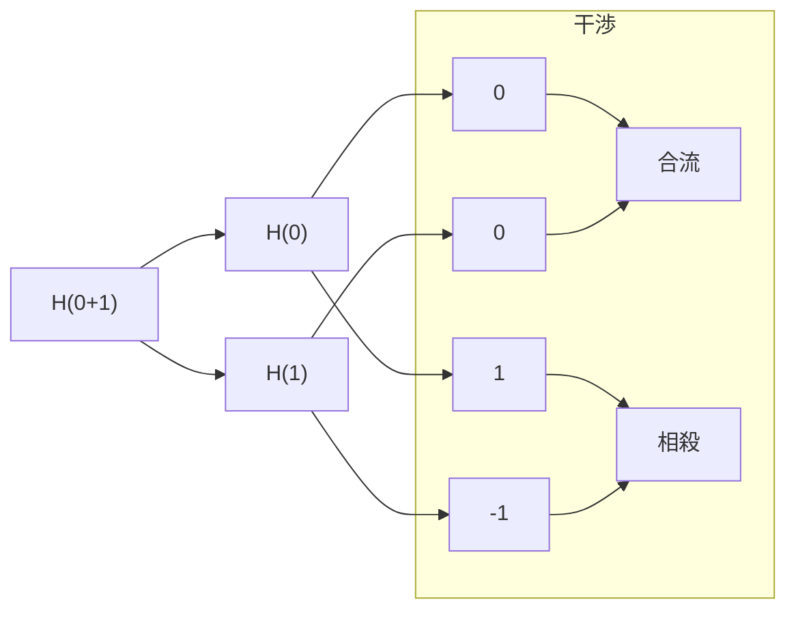
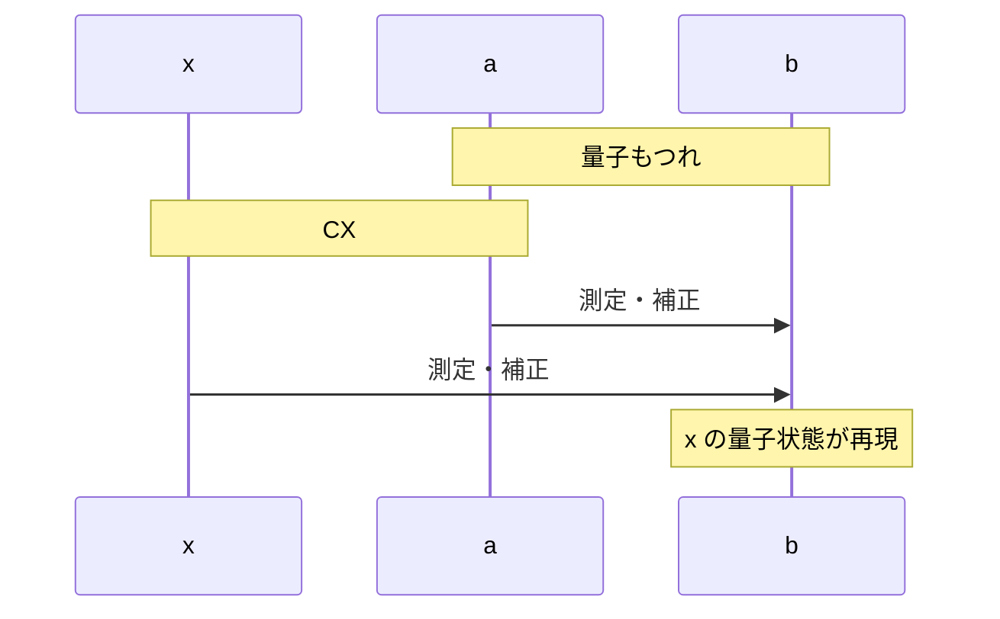

量子コンピューターの初歩の初歩を説明します。数学的準備を最低限に留めるため、簡略化した表記法を採用して、基本原理の直観的理解を目指します。前提とするのは 2 進数のビット演算と中学数学で、量子力学の知識は前提としません。blueqat ライブラリによる検証法も説明します。

シリーズの記事です。

1. 量子コンピューター超入門 ← この記事
2. [量子コンピューター超入門2 一般的な表記法](https://qiita.com/7shi/items/1704b58f8828601a0e6c)

# はじめに

量子コンピューターは革新の可能性を秘めた分野です。しかしながら、量子力学に基づくため、その動作原理を理解するのは容易なことではありません。

量子力学では複素数による確率振幅の重ね合わせ、量子もつれ、測定による量子状態の収束など、古典物理学とは全く異なる概念が導入されます。これらを厳密に記述するには、大学レベルの数学が必要になります。こうした複雑さは量子コンピューターを理解する上で障壁となります。

本記事では中核的な概念だけを抽出して、簡略化した表記法で説明します。また、量子アルゴリズムについても、コンセプトから試行錯誤で作り上げる方針で進めます。

## 本記事の表記法

一般に、量子ビットの基底状態は $\ket{0}$ と $\ket{1}$ で表記しますが、本記事では 0 と 1 で表記します。重ね合わせ状態 $(\ket{0}+\ket{1})/\sqrt{2}$  や $(\ket{0}-\ket{1})/\sqrt{2}$ は係数を省略して 0+1 や 0-1 と簡略化します。例えば H ゲートの作用は H(0) = 0+1 のように書きます。

この表記法には表現上の制約があり、一般の量子状態を正確に記述することはできません。本記事では制約の範囲内で問題なく記述できる題材に絞っており、簡略化による影響を気にせず読み進めることができます。

独自の表記法だけでは他の資料を読むのに問題があるため、[続編](https://qiita.com/7shi/items/1704b58f8828601a0e6c)では一般的な表記法との対応について説明します。

# 基礎的な量子ビット表現

量子ビットは 0 と 1 の記号で表されます。これらは古典ビットの 0 と 1 に対応する量子状態で、**基底状態**と呼びます。これらは数値ではなく、変数 x, y のような文字として扱います。

量子ビットの特徴は、0 と 1 の中間的な状態をとれる点にあります。これを**重ね合わせ状態**と呼び、0+1 や 0-1 のように表記します。

重ね合わせ状態は、量子コンピューティングの源泉となる、量子力学の重要な性質です。0 または 1 のどちらか一方だけではなく、中間的な状態を持つことで、並列性や量子アルゴリズムの高速化が実現できます。

## 測定によるランダム選択

重ね合わせ状態にある量子ビットを測定すれば、0 か 1 のどちらか一方がランダムに選択されます。測定によって重ね合わせ状態から基底状態に移行することを**収束**と呼びます。

収束の過程は完全にランダムで、事前にどちらが選択されるかを知ることはできません。確率を調整することは可能ですが、本記事では等確率のケースのみを扱います。

0+1 は 50% の確率で 0 に、50% の確率で 1 になります。測定を M と表記して回路図で示します。
```
0+1 - M - 0 (50%)
0+1 - M - 1 (50%)
```
この測定による収束は、量子コンピューターと古典コンピューターの大きな違いの一つです。量子コンピューターは計算途中に重ね合わせ状態を保持しますが、結果を得るには測定する必要があるため、最終的には 0 か 1 のどちらかに収束することになります。この測定の性質は、量子アルゴリズムを設計する上で重要な役割を果たします。

:::note info
量子コンピューターをスロットマシーンに例えれば、計算中はスロットが回っていて、最終的にはストップさせて計算が確定するイメージです。意味のある計算結果を得るために、スロットの回し方を工夫するのが量子回路だと言えます。
:::

# 量子ゲート

量子コンピューティングでは、量子ビットに対して様々な量子ゲートを作用させることで、計算を行います。本記事では基本となる 4 種類の量子ゲート (H, X, CX, CCX) だけを扱います。

## H ゲート
```
- H -
```
H ゲート（アダマールゲート）は基底状態と重ね合わせ状態を入れ替えるゲートです。

基底状態の量子ビットを H ゲートに通せば、重ね合わせ状態に移行します。ゲートを通る前の状態に応じて、符号の違いがあります。
```
H(0) = 0+1
H(1) = 0-1
```
重ね合わせ状態の量子ビットを H ゲートに通せば、元の基底状態に戻ります。測定ではないため、ランダムではありません。
```
H(0+1) = 0
H(0-1) = 1
```
0+1 と 0-1 を区別することで、2 回の作用で元に戻る性質が実現できます。

なお、測定に符号は影響しないため、0+1 と 0-1 を測定すれば、どちらも 0 と 1 が 50% の確率でランダムに現れます。

:::note info
2 回の作用で元に戻るのは、本記事で扱うすべての量子ゲートに共通する性質です。一方、測定は元に戻らない破壊的な操作で、量子ゲートには含まれません。
:::

状態の変化を回路図で示します。
```
0 - H - 0+1 - H - 0
1 - H - 0-1 - H - 1
```

### 項ごとの計算

重ね合わせ状態は基底状態の組み合わせとして計算できます。項ごとに H ゲートが作用します。
```
H(0+1) = H(0) + H(1) = (0+1)+(0-1)
H(0-1) = H(0) - H(1) = (0+1)-(0-1)
```
0, 1 は数値として計算するのではなく、変数のように計算します。0, 1 を x, y に置き換えた計算を示します。
```
(0+1)+(0-1) → (x+y)+(x-y) = x+y+x-y = 2x
(0+1)-(0-1) → (x+y)-(x-y) = x+y-x+y = 2y
```
係数を取り除いて 0, 1 に戻します。
```
2x → x → 0
2y → y → 1
```
このような計算が成り立つように 0+1, 0-1 の符号が決められています。

### 計算の解釈

H ゲートを通過する際、重ね合わせ状態は維持されます。これは 0 または 1 が出る可能性がある状態です。項ごとに分割して H ゲートの作用を計算することは、想定される可能性ごとに場合分けしていると解釈できます。
```
H(0+1) = H(0) + H(1)
```
重ね合わせ状態の量子ビットを H ゲートに通すことで、場合分けが分岐して細分化されます。
```
H(0) + H(1) = (0+1)+(0-1) = (0+0)+(1-1)
```
0+0 は 2 つの場合に 0 が現れることを意味しますが、同じ値を場合分けする必要はないため 1 つの 0 に合流します。`1-1` のように相殺すれば、そこで場合分けは打ち切ります。
```
(0+0)+(1-1) = 0
```
このように分岐・合流・相殺の過程が数式で表現されます。このような合流・相殺を**干渉**と呼びます。干渉の様子を図で示します。



分岐を場合分けと考えれば、合流はともかく、相殺は不思議に思われるかもしれません。これは H ゲートで測定が行われるわけではなく、値が確定しないまま通過し、その時点では「1 が出るかもしれない」という可能性に留まるためです。相殺はその可能性がないことを意味します。

:::note warn
これについては様々な解釈がありますが、あまり深入りしても理解が深まるとは言えない面があります。もしこの説明に納得できなくても、計算上のことと割り切って先に進むことをお勧めします。色々な例に触れていくことで、捉え方が見えてくるはずです。
:::

## X ゲート
```
- X -
```
X ゲートはビット反転を行う量子ゲートです。0 なら 1 に、1 なら 0 に反転させる働きがあります。
```
X(0) = 1
X(1) = 0
```
状態の変化を回路図で示します。
```
0 - X - X - 0
```
### 重ね合わせ状態の計算

H ゲートと同様に、重ね合わせ状態への作用は基底状態の組み合わせとして計算できます。
```
X(0+1) = X(0)+X(1) = 1+0 =  0+1
X(0-1) = X(0)-X(1) = 1-0 = -0+1
```
新しい符号の組み合わせ -0+1 が現れました。これを再度 X ゲートに通せば、元に戻ることが確認できます。
```
X(-0+1) = -X(0)+X(1) = -1+0 = 0-1
```
次に -0+1 を H ゲートに通してみます。係数を取り除く際、符号は残します。
```
H(-0+1) = -H(0)+H(1) = -(0+1)+(0-1) = (0-0)-(1+1) = -1
```
単独で -1 が現れました。これを X ゲートに通せば -0 が得られます。
```
X(-1) = -X(1) = -0
```
0 にマイナスが付くのは奇妙に思えますが、0 は変数 x のような文字として扱うため、x と -x が別物であるように、0 と -0 は区別されます。

### 符号の反転

先ほどの例で -1 が得られた計算過程をまとめます。
```
1 - H - 0-1 - X - -0+1 - H - -1

H(X(H(1))) = H(X(0-1)) = H(-0+1) = -1
```
逆の計算は、符号を外に出せば簡単に確認できます。
```
H(X(H(-1))) = -H(X(H(1))) = -(-1) = 1
```
一方、0 は符号反転しません。
```
H(X(H(0))) = H(X(0+1)) = H(0+1) = 0
```
このように HXH という組み合わせは ±1 のみ符号反転させます。

:::note info
HXH は Z ゲートと呼ばれます。慣れないうちにゲートの種類が増えると混乱するため、本記事では Z ゲートという名称は使用しません。
:::

なお、以下の計算によって -0-1 が得られます。
```
H(-0) = -H(0) = -0-1
```
まとめると、H ゲートと X ゲートの組み合わせから、以下の 8 種類の量子状態が得られます。本記事で扱う量子状態はこれで全部です。

- 基底状態: 0, -0, 1, -1
- 重ね合わせ状態: 0+1, -0-1, 0-1, -0+1

## CX ゲート
```
- C -
  |
- X -
```
CXゲート（制御 NOT ゲート）は 2 つの量子ビットに作用するゲートです。C は制御ゲートと呼ばれ、ここを通る量子ビットが 1 の場合にだけ X ゲートが作用します。数式では両方のビットを並べて計算します。
```
CX(00) = 00
CX(01) = 01
CX(10) = 11  反転
CX(11) = 10  反転
```
下の 2 つで右側のビットが反転します。

出力から右側の量子ビットだけを取り出せば、古典ゲートの XOR に対応します。
```
0 XOR 0 = 0
0 XOR 1 = 1
1 XOR 0 = 1
1 XOR 1 = 0
```
### 重ね合わせ状態の計算

ビットを並べる際、重ね合わせ状態が含まれれば、文字式の展開のように分配します。x, y に置き換えた計算例を示します。ビットとしての順序を保つ必要があるため、$xx=x^2,\ xy=yx$ のような変形はできません。
```
(0+1)0 → (x+y)x = xx+yx → 00+10
```
00+10 は、測定したときに 00 と 10 が  50% の確率で現れることを意味します。CX ゲートに通せば項ごとに作用します。
```
CX(00+10) = CX(00)+CX(10) = 00+11
```
両方のビットが重ね合わせ状態の場合の計算例を示します。
```
CX((0+1)(0-1))
= CX(00-01+10-11)
= CX(00)-CX(01)+CX(10)-CX(11)
= 00-01+11-10
```
これは 4 つの状態の重ね合わせです。測定すれば 00, 01, 11, 10 が 25% ずつの確率で現れます。項の符号は確率に影響しません。

## CCX ゲート
```
- C -
  |
- C -
  |  
- X -  
```
CCX ゲート（トフォリゲート）は CX ゲートの制御ゲートを増やしたゲートです。2 つの制御ゲート C を通過する量子ビットが共に 1 の場合にのみ、X ゲートが作用します。数式では 3 つのビットを並べて計算します。
```
CCX(000) = 000
CCX(001) = 001
CCX(010) = 010
CCX(011) = 011
CCX(100) = 100
CCX(101) = 101
CCX(110) = 111  反転
CCX(111) = 110  反転
```
下の 2 つで右側のビットが反転します。

出力から右側の量子ビットだけを取り出せば、古典ゲートの AND と XOR の組み合わせに対応します。
```
(0 AND 0) XOR 0 = 0
(0 AND 0) XOR 1 = 1
(0 AND 1) XOR 0 = 0
(0 AND 1) XOR 1 = 1
(1 AND 0) XOR 0 = 0
(1 AND 0) XOR 1 = 1
(1 AND 1) XOR 0 = 1
(1 AND 1) XOR 1 = 0
```
# 重ね合わせによる並列計算

量子ゲートで簡単な論理回路を構成して、重ね合わせ状態による並列計算を試みます。

## 出力の分離

CX ゲートでは 2 番目の量子ビットが書き換わります。入力を保持して出力を分離するには、出力を受け取る量子ビットを用意して、CX ゲートを 2 つ使用します。
```
in  a: a - C - - -
           |
in  b: b - | - C -
           |   |
out c: 0 - X - X -

c = a XOR b
```
## 並列計算

XOR 回路に重ね合わせ状態を入力します。
```
in  a: 0 - H - C - - -
               |
in  b: 0 - H - | - C -
               |   |
out c: 0 - - - X - X -

        000
[HH-] → H(0)H(0)0
      = (0+1)(0+1)0
      = (00+01+10+11)0
      = 000+010+100+110
[C-X] → 000+010+101+111
[-CX] → 000+011+101+110
```
`a XOR b = c` となる組み合わせが得られました。
```
000: 0 XOR 0 = 0
011: 0 XOR 1 = 1
101: 1 XOR 0 = 1
110: 1 XOR 1 = 0
```
理論的にはすべての組み合わせを並列計算していることになります。これはなかなかインパクトがあります。しかし実際には結果を得るには測定する必要があり、1 回の計算につきどれか 1 つの結果がランダムに得られるだけです。すべての組み合わせを得るには複数回測定を繰り返す必要があります。

## blueqat

複数回測定を体験するため、blueqat という Python の量子計算ライブラリでシミュレーションします。私が試した限りでは 1.0.4 が安定しているようです。
```
pip install blueqat==1.0.4
```
blueqat は回路図を直観的にコード化できるため、ちょっとした回路の動作を手軽に確認できます。最後に測定する必要があります。
```
0 - H - C - - - M
        |
0 - H - | - C - M
        |   |
0 - - - X - X - M
```
```python
>>> from blueqat import Circuit
>>> Circuit().h[0,1].cx[0,2].cx[1,2].m[:].shots(100)
Counter({'000': 27, '011': 26, '101': 24, '110': 23})
```
量子ゲートを置くラインを配列の添え字で指定します。`shots(100)` によって測定を 100 回繰り返します。`'000': 28` は 000 が 28 回現れたという意味です。結果はランダムなため毎回変わります。ログの可読性を考慮して意図的にビット列を昇順に並べていますが、実際には出現順に並ぶため、昇順に並ぶことはまれです。

以後、回路図には blueqat でのシミュレーション結果を添えます。最後に測定を行いますが、回路図からは省略します。

## 半加算器

古典的な論理回路の焼き直しですが、量子回路の構成に慣れるため半加算器を実装します。
```
in  a: 0 - H - C - C - - -
               |   |
in  b: 0 - H - C - | - C -
               |   |   |
out c: 0 - - - X - | - | - (carry)
                   |   |
out s: 0 - - - - - X - X - (sum)

         0000
[HH--] → H(0)H(0)00
       = (0+1)(0+1)00
       = (00+01+10+11)00
       = 0000+0100+1000+1100
[CCX-] → CCX(000)0+CCX(010)0+CCX(100)0+CCX(110)0
       = 0000+0100+1000+1110
[C--X] → 0000+0100+1001+1111
[-C-X] → 0000+0101+1001+1110
```
```python
>>> Circuit().h[0,1].ccx[0,1,2].cx[0,3].cx[1,3].m[:].shots(100)
Counter({'0000': 34, '0101': 24, '1001': 23, '1110': 19})
```
`a + b = cs` となる組み合わせが得られました。
```
0000: 0 + 0 = 00
0101: 0 + 1 = 01
1001: 1 + 0 = 01
1110: 1 + 1 = 10
```
理論上、CCX ゲートを使えば古典的な論理回路が再現できるため、練習として AND や OR などを考えてみると良いでしょう。

## 重ね合わせと測定

回路の途中で測定を行うことで、重ね合わせ状態を解除（基底状態に収束）できます。測定の有無で結果が変わる例を示します。
```
0 - H - H - 0

      0
[H] → H(0) = 0+1
[H] → H(0+1) = 0

0 - H - M - H - 0+1 または 0-1

      0
[H] → H(0) = 0+1
[M] → 0 または 1
[H] → H(0) = 0+1 または H(1) = 0-1
```
測定した時点で値が確定するため、それ以降の H(0) と H(1) は干渉することがなく、1 は相殺しません。シミュレーション結果でも確認できます。
```python
>>> Circuit().h[0].h[0].m[:].shots(100)
Counter({'0': 100})
>>> Circuit().h[0].m[0].h[0].m[:].shots(100)
Counter({'0': 54, '1': 46})
```
このように回路の途中で測定を挟めば、重ね合わせとは扱いの異なる場合分けが発生します。ただし、基本的に測定は最後に行うため、このようなパターンはあまり使いません。

# 量子もつれ

量子力学における**量子もつれ**とは、2つ以上の量子系が絡み合った状態を指します。この性質は量子コンピューターの大きな力の源泉となります。

## 量子もつれの生成

2 つの量子ビット a, b が初期状態 00 のとき、a を H ゲートに通してから、両方を CX ゲートに通すことで、量子もつれ状態が生成できます。
```
a: 0 - H - C -
           |   00+11
b: 0 - - - X -

       00
[H-] → H(0)0 = (0+1)0 = 00+10
[CX] → CX(00+10) = CX(00)+CX(10) = 00+11
```
```python
>>> Circuit().h[0].cx[0,1].m[:].shots(100)
Counter({'00': 53, '11': 47})
```
量子もつれ状態は、数式では複数の量子ビットが因数分解できない状態として現れます。CX を通す前の 00+10 は (0+1)0 と因数分解できるのに対して、CX を通した後の 00+11 は因数分解できません。

因数分解した (0+1)0 は a = 0+1, b = 0 として a, b の状態が特定できます。それに対して 00+11 のように因数分解できない状態は、a, b をそれぞれ独立に扱うことができません。つまり、a の量子ビットだけ、b の量子ビットだけを取り出して個別に記述できなくなっています。このような状態を指して「絡み合う」「もつれる」と表現します。

## 量子もつれの解除

量子もつれ状態のまま再度 CX ゲートに通します。
```
0 - H - C - C - 0+1
        |   |
0 - - - X - X - 0

       00
[H-] → H(0)0 = (0+1)0 = 00+10
[CX] → CX(00+10) = 00+11
[CX] → CX(00+11) = 00+10 = (0+1)0
```
```python
>>> Circuit().h[0].cx[0,1].cx[0,1].m[:].shots(100)
Counter({'00': 51, '10': 49})
```
各量子ビットの状態が別々に記述できるようになり、量子もつれは解除されたことになります。

このように、CX ゲートは 2 量子ビットの間で量子もつれを生成・解除する働きがあります。

## 量子もつれにならないパターン

CX ゲートに通す前に両方を重ね合わせ状態にしてみます。
```
0 - H - C - 0+1
        |
0 - H - X - 0+1

CX((0+1)(0+1))
= CX(00+01+10+11)
= 00+01+10+11
= (0+1)(0+1)
```
```python
>>> Circuit().h[0,1].cx[0,1].m[:].shots(100)  
Counter({'00': 30, '01': 27, '10': 25, '11': 18})
```
CX ゲートを通っても状態は変化しません。因数分解は可能なままで、量子もつれ状態にはなりません。

片方のビットを反転させてみます。
```
0 - - - H - C - 0-1
            |
0 - X - H - X - 0-1

       00
[-X] → 0X(0) = 01
[HH] → H(0)H(1) = (0+1)(0-1) = 00-01+10-11
[CX] → CX(00-01+10-11)
	 = 00-01+11-10
	 = 00-01-10+11
	 = 0(0-1)-1(0-1)
	 = (0-1)(0-1)
```
```python
>>> Circuit().x[1].h[0,1].cx[0,1].m[:].shots(100)  
Counter({'00': 29, '01': 27, '10': 25, '11': 19})
```
こちらも量子もつれにはなりませんが、制御ビットの側が 0+1 から 0-1 に変化しています。量子もつれにならなくても、制御ビットの側が影響を受けることがあるわけです。

## 測定と相関

計算上は 2 つの量子ビットをまとめて扱いますが、測定は個々の量子ビットに対して行います。

量子ビット a, b がもつれた状態 00+11 の場合に、a と b を測定します。a が 0 になれば b も 0 になり、a が 1 になれば b も 1 になります。このように a と b の測定結果に関連性があることを**相関**と呼びます。

一方、量子もつれが解除された 00+10 = (0+1)0 では、a はランダムに 0 または 1 が出力されるのに対して、b は常に 0 です。a と b の測定結果に相関はありません。

このように、量子もつれを生成・解除することで、2 つの量子ビットの間に相関の有無が生じます。量子コンピューターではこの量子もつれの性質を計算に利用します。

## 量子ゲートの作用

量子もつれの状態で量子ゲートがどのように作用するかを、順を追って説明します。

### 準備

まず基底状態 0 の量子ビットを H ゲートに通します。
```
0 - H - H - 0

0 → H(0) = 0+1 → H(0+1) = 0
```
これに別の量子ビットを付け加えて数式上まとめて扱っても、単に並べて書くだけです。
```
0 - H - H - 0

0 - - - - - 0

00 → H(0)0 = (0+1)0 → H(0+1)0 = 00
```
途中の式を展開します。
```
H(0)0 = (0+1)0 = 00+10
```
この状態で 1 番目のビットだけを H ゲートに通すには、00 と 10 を場合分けして考えます。
```
00 → H(0)0
10 → H(1)0
```
これをまとめます。
```
00+10 → H(0)0+H(1)0 = (00+10)+(00-10) = 00
```
量子もつれ状態であっても、H ゲートは対応する量子ビットにだけ作用することが分かります。

### 量子もつれ状態での作用

量子もつれ状態での H ゲートの作用も、同様に計算できます。
```
0 - H - C - H -
        |       00+01+10-11
0 - - - X - - -

       00
[H-] → H(0)0 = (0+1)0 = 00+10
[CX] → CX(00+10) = CX(00)+CX(10) = 00+11
[H-] → H(0)0+H(1)1 = (0+1)0+(0-1)1 = 00+10+01-11
```
```python
>>> Circuit().h[0].cx[0,1].h[0].m[:].shots(100)
Counter({'00': 30, '01': 26, '10': 23, '11': 21})
```
H ゲートを 2 回通せば元の 0 に戻りますが、間に CX ゲートを挟むことで結果が変わることに注意してください。計算過程を見ると、1 量子ビットでは 1-1 で相殺していたのが、2 量子ビットでは 10-11 となって残ります。これが「もつれ」ということです。

2 番目の H ゲートの位置を変更します。
```
0 - H - C - - -
        |       00+01+10-11
0 - - - X - H -

       00
[H-] → H(0)0 = (0+1)0 = 00+10
[CX] → CX(00+10) = CX(00)+CX(10) = 00+11
[-H] → 0H(0)+1H(1) = 0(0+1)+1(0-1) = 00+01+10-11
```
```python
>>> Circuit().h[0].cx[0,1].h[1].m[:].shots(100)
Counter({'00': 29, '01': 28, '10': 27, '11': 16})
```
両方に置きます。
```
0 - H - C - H -
        |       00+11
0 - - - X - H -

       00
[H-] → H(0)0 = (0+1)0 = 00+10
[CX] → CX(00+10) = CX(00)+CX(10) = 00+11
[HH] → H(0)H(0)+H(1)H(1)
     = (0+1)(0+1)+(0-1)(0-1)
     = 00+01+10+11+00-01-10+11
     = 00+11
```
```python
>>> Circuit().h[0].cx[0,1].h[0,1].m[:].shots(100)
Counter({'00': 55, '11': 45})
```
まとめれば、H ゲートをどちらか片方に置けば 00+01+10-11 となり、両方に置けば 00+11 に戻ります。片方だけを見ればランダムに 0 または 1 が出る状況は変わりませんが、両方を見れば相関が変わります。

# 量子アルゴリズム

量子コンピューターでは、重ね合わせ状態によって並列計算が可能になります。しかし、結果を測定する際には 1 つの確定した値しか得られません。もし単に並列計算をして 1 つの結果を取り出すだけでは、量子コンピューターの本当の力を発揮できません。

そこで登場するのが量子アルゴリズムです。量子アルゴリズムでは、重ね合わせ状態における並列性を巧みに利用しながら、最終的な測定結果の確率分布を調整することで、求める解を効率的に得られるような工夫がなされています。

つまり、量子計算の力を最大限に活かすには、単に並列計算ができるというだけでは不十分で、量子的な性質を適切に利用して、望む結果を得やすくするような量子回路を設計する必要があるのです。この量子的な性質を巧妙に利用した計算手順こそが、量子アルゴリズムと呼ばれるものなのです。

ここまでの説明の範囲内で、基礎的な量子アルゴリズムを紹介します。

## ドイッチュのアルゴリズム

ドイッチュのアルゴリズムは、量子計算の並列性を引き出すための基本となるアルゴリズムです。

入力と出力がともに 1 ビットの関数 F があります。入力と出力は 2 × 2 = 4 パターンあるため、番号で区別します。

- F0(0) = 0, F0(1) = 0 （定数関数）
- F1(0) = 0, F1(1) = 1 （均等関数）
- F2(0) = 1, F2(0) = 0 （均等関数）
- F3(0) = 1, F3(0) = 1 （定数関数）

これらは定数関数（常に同じ値を返す）と均等関数（0 と 1 を返すパターン数が等しい）に分類できます。

仕様が不明な F を渡されて、定数関数か均等関数かを判定することを考えます。古典コンピューターでは F(0) と F(1) の両方を計算して、その結果から判定することになります。

それに対してドイッチュのアルゴリズムでは、重ね合わせを利用して、1回の関数呼び出しで定数関数か均等関数かを判定できます。

### 関数の構成

関数を構成します。
```
in  F0: -
    |
out F0: -

in  F1: - C - 
    |     |
out F1: - X -

in  F2: - C - - -
    |     |
out F2: - X - X -

in  F3: - - -
    |
out F3: - X -
```
```python
Fs = [Circuit(2),
	  Circuit().cx[0,1],
	  Circuit().cx[0,1].x[1],
	  Circuit().x[1]]
```
F0 は何もしないため、量子ビット数を明示的に指定します。

### 試行錯誤

量子ビットを 2 つ用意して、入力と出力に割り当てます。XOR や半加算器で行ったのと同様に、入力を重ね合わせ状態にします。
```
in  a: 0 - H - F -
               |
out b: 0 - - - F -

       00
[H-] → H(0)0 = (0 + 1)0 = 00+10
[FF] → 0F(0)+1F(1)

F0: 00+10, F1: 00+11, F2: 01+10, F3: 01+11
```
```python
>>> [(Circuit().h[0] + F).m[:].shots(100) for F in Fs]
[Counter({'00': 56, '10': 44}),
 Counter({'00': 53, '11': 47}),
 Counter({'01': 55, '10': 45}),
 Counter({'01': 58, '11': 42})]
```
均等関数 F1, F2 で入力と出力に相関が見られます。関数の実装を考えれば、H ゲートで生成した 0+1 に CX ゲートを適用しているため、典型的な量子もつれ生成のパターンになっています。

b にも H ゲートを適用することで、量子もつれを抑制してみます。
```
in  a: 0 - H - F -
               |
out b: 0 - H - F -

       00
[HH] → H(0)H(0) = (0+1)(0+1) = 00+01+10+11
```
00+10 は先ほどと同様です。01+11 は、F の出力が 1 との XOR で反転します。
```
[FF] → 0F(0)+0X(F(0))+1F(1)+1X(F(1))
     = 0(F(0)+X(F(0)))+1(F(1)+X(F(1)))
```
F(0)+X(F(0)) は F が 0 でも 1 でも 0+1 になります。F(1)+X(F(1)) も同様です。
```
     = 0(0+1)+1(0+1)
     = 00+01+10+11
```
```python
>>> [(Circuit().h[0,1] + F).m[:].shots(100) for F in Fs]
[Counter({'00': 35, '01': 26, '10': 21, '11': 18}),
 Counter({'00': 35, '01': 26, '10': 22, '11': 17}),
 Counter({'00': 27, '01': 25, '10': 24, '11': 24}),
 Counter({'00': 31, '01': 30, '10': 21, '11': 18})]
```
区別が付かなくなってしまいました。

均等関数では入力に応じて出力を生成するため CX ゲートを使用しています。量子もつれにならないパターンとして示した、CX ゲートで C に変化が生じる組み合わせで検出を試みます。具体的には b の最初に X ゲートを追加します。
```
in  a: 0 - - - H - F -
                   |
out b: 0 - X - H - F -

       00
[-X] → 0X(0) = 01
[HH] → H(0)H(1) = (0+1)(0-1) = 0(0-1)+1(0-1)
[FF] → 0(F(0)-X(F(0)))+1(F(1)-X(F(1)))

F(0) = F(1) のとき (0+1)(F(0)-X(F(0)))
F(0) ≠ F(1) のとき (0-1)(F(0)-X(F(0)))

F(0) = 0 のとき F(0)-X(F(0)) =   0-1
F(0) = 1 のとき F(0)-X(F(0)) = -(0-1)

F(0) に応じて決まる符号の違いを ± で表せば
定数関数: ±(0+1)(0-1) = ±(00-01+10-11)
均等関数: ±(0-1)(0-1) = ±(00-01-10+11)
```
```python
>>> [(Circuit().x[1].h[0,1] + F).m[:].shots(100) for F in Fs]
[Counter({'00': 27, '01': 25, '10': 24, '11': 24}),
 Counter({'00': 29, '01': 26, '10': 24, '11': 21}),
 Counter({'00': 28, '01': 27, '10': 23, '11': 22}),
 Counter({'00': 30, '01': 29, '10': 21, '11': 20})]
```
測定結果では区別が付きませんが、測定前の a の状態は異なります。動機として CX ゲートを検出するとしましたが、計算上は F(0) = F(1) かどうかで重ね合わせの状態が変化します。関数値で決まるため、内部実装がブラックボックスでも計算は可能です。

### 量子回路の構成

a に H ゲートを追加すれば、0+1 と 0-1 の違いが区別できるようになります。このように重ね合わせ状態で主要な計算を行って、得られた状態の重ね合わせを解除するパターンは、よく使われます。
```
in  a: 0 - - - H - F - H -
                   |
out b: 0 - X - H - F - - -

       00
[-X] → 0X(0) = 01
[HH] → H(0)H(1) = (0+1)(0-1) = 0(0-1)+1(0-1)
[FF] → 0(F(0)-X(F(0)))+1(F(1)-X(F(1)))
[H-] → H(0)(F(0)-X(F(0)))+H(1)(F(1)-X(F(1)))

定数関数: ±H(0+1)(0-1) = ±0(0-1) = ±(00-01)
均等関数: ±H(0-1)(0-1) = ±1(0-1) = ±(10-11)
```
```python
>>> [(Circuit().x[1].h[0,1] + F).h[0].m[:].shots(100) for F in Fs]
[Counter({'00': 58, '01': 42}),
 Counter({'10': 54, '11': 46}),
 Counter({'10': 50, '11': 50}),
 Counter({'00': 59, '01': 41})]
```
a の測定結果が 0 なら定数関数、1 なら均等関数です。つまり、1 回の関数呼び出しと量子ゲートの操作で、定数関数か均等関数かを判定できました。この手順がドイッチュのアルゴリズムと呼ばれています。

なお、関数の出力値を特定するには、追加で F(0) を計算する必要があります。これは関数を 2 回計算することになり、古典コンピューターに対する優位性はありません。しかし、後で述べるように、入力を複数ビットに拡張したときに真価を発揮します。

### 考え方

古典コンピューターでは 2 回の関数呼び出しが必要でしたが、量子コンピューターでは重ね合わせを活かすことで、関数呼び出しを 1 回に削減できました。これは、量子重ね合わせによる並列計算を活用した結果です。単純な例ながら、このように量子的な性質を利用することで、古典的なアプローチよりも効率的な計算が可能になる、ということが量子アルゴリズムの基本的なアイデアです。

しかしながら、量子重ね合わせによる並列計算の結果そのものを直接取得することはできません。代わりに、ドイッチュのアルゴリズムのように、関数がある特定の性質（定数関数か均等関数か）を持つかどうかを判定することはできます。

ドイッチュのアルゴリズム自体は特殊な状況を想定しており実用的ではありませんが、この「性質の絞り込み」の考え方が量子アルゴリズムの本質的な部分であり、実用的な量子アルゴリズムを設計する際にも同様のアプローチが求められます。求める解の性質を見定め、それに合わせて量子状態を作り変える回路を工夫する、そういった発想が量子アルゴリズム設計の要となります。

## ドイッチュ・ジョサのアルゴリズム

ドイッチュのアルゴリズムは関数の入力が 1 ビットに限定されていましたが、ドイッチュ・ジョサのアルゴリズムでは入力のビット数が任意のサイズに拡張されます。入力のサイズが増えても計算は 1 回で済むため、古典コンピューターとの違いが明らかになります。

以下では、例として 2 ビットの場合を示します。

### 関数の構成

関数は入力が 2 ビットで出力が 1 ビットです。$2+{}_4C_2=8$ パターンあるため、番号で区別します。

- F0(00) = 0, F0(01) = 0, F0(10) = 0, F0(11) = 0 （定数関数）
- F1(00) = 0, F1(01) = 0, F1(10) = 1, F1(11) = 1 （均等関数）
- F2(00) = 0, F2(01) = 1, F2(10) = 0, F2(11) = 1 （均等関数）
- F3(00) = 0, F3(01) = 1, F3(10) = 1, F3(11) = 0 （均等関数）
- F4(00) = 1, F4(01) = 0, F4(10) = 0, F4(11) = 1 （均等関数）
- F5(00) = 1, F5(01) = 0, F5(10) = 1, F5(11) = 0 （均等関数）
- F6(00) = 1, F6(01) = 1, F6(10) = 0, F6(11) = 0 （均等関数）
- F7(00) = 1, F7(01) = 1, F7(10) = 1, F7(11) = 1 （定数関数）

:::note info
4 桁の 2 進数 (0000～1111) を昇順に並べて関数の出力に見立て、定数関数にも均等関数にもならない並びを除外した順番です。
:::

アルゴリズム自体は関数の出力値から考察できるため、具体的な実装がなくても進められますが、参考までに F3 の実装例を示します。
```
in  F3: - X - C - X - C - - -
              |       |
in  F3: - - - C - X - C - X -
              |       |
out F3: - - - X - - - X - - -
```
実装方針は以下の通りです。

- F3(01) = F3(10) = 1 より、01 と 10 で out を反転します。
- 01 は左側のビットを反転すれば 11 になって、CCX ゲートで判定できます。10 も同様。
- 判定後に再度 X ゲートを通して、元に戻します。

入力が 3 ビット以上のときは、制御ゲートを増やした多制御トフォリゲートを使用します。

### 量子回路の構成

基本的な構成は 1 ビットのときと同じで、入力が増えます。
```
in  a: 0 - - - H - F - H -
                   |
in  b: 0 - - - H - F - H -
                   |
out c: 0 - X - H - F - - -
```
数式も 1 ビットを拡張した形式になります。H(00) = H(0)H(0) と略記して示します。
```
 H(00)(F(00)-X(F(00)))
+H(01)(F(01)-X(F(01)))
+H(10)(F(10)-X(F(10)))
+H(11)(F(11)-X(F(11)))
```
定数関数は (F(..)-X(F(..))) がすべて同じになります。1 ビットと同様に入力だけを見れば良いため、H(..) の部分を計算します。
```
H(00)+H(01)+H(10)+H(11)
= H(00+01+10+11)
= H((0+1)(0+1))
= H(0+1)H(0+1)
= 00
```
均等関数において、F1 と F6、F2 と F5、F3 と F4 は出力の 0 と 1 が逆になっており、全体の符号は反転しますが、測定結果は同じです。F1, F2, F3 について a, b の測定結果を計算します。

1. H(00+01-10-11) = H(0-1)H(0+1) = 10
2. H(00-01+10-11) = H(0+1)H(0-1) = 01
3. H(00-01-10+11) = H(0-1)H(0-1) = 11

以上より、ab = 00 であれば定数関数、それ以外は均等関数だと判定できます。

また、均等関数の測定結果 10 から H(10) のように逆算すれば、F1 か F6 だと絞り込めます。追加で F(00) を計算すれば特定できます。つまり、入力サイズに関わらず、2 回の計算で関数のすべての出力値が特定できるわけです。これは古典コンピューターとはまったく異なる、量子コンピューターならではの振る舞いです。

なお、blueqat で検証するには F を具体的に実装する必要がありますが、8 パターンの F を実装すると煩雑になるため省略しました。練習として考えてみると良いでしょう。

## グローバーのアルゴリズム

グローバーのアルゴリズムは、数多くの入力の中から特定の条件を満たす解を効率的に見つけ出すための、量子アルゴリズムの 1 つです。古典コンピューターでは総当たり的な探索が必要になりますが、グローバーのアルゴリズムでは重ね合わせ状態と量子ゲートを巧みに組み合わせることで、より効率的な探索が可能になります。

具体的には、どれか 1 つの入力値に対してのみ反応する関数を用意して、その入力値を探します。関数は入力ラインのみで出力ラインを持ちません。特定の値が入力されれば、入力ラインの符号を反転させます。

### 関数の構成

関数の入力を 2 ビットとします。$2^2=4$ パターンあるため、番号で区別します。

- F0: 00 が入力されたときに符号を反転
- F1: 01 が入力されたときに符号を反転
- F2: 10 が入力されたときに符号を反転
- F3: 11 が入力されたときに符号を反転

符号の反転には HXH を使用します。HXH は 1 だけを符号反転させるため、X ゲートの部分を CX ゲートに置き換えれば、11 だけを反転できます。そのためまず F3 を実装します。
```
in F3: - - - C - - -
             |
in F3: - H - X - H -
```
個別に 00, 01, 10, 11 を入力して挙動を確認します。
```
F3(00): CX(0(H(0))) = CX(00+01) = 00+01 →  0H(0+1) =  00
F3(01): CX(0(H(1))) = CX(00-01) = 00-01 →  0H(0-1) =  01
F3(10): CX(1(H(0))) = CX(10+11) = 11+10 →  1H(0+1) =  10
F3(11): CX(1(H(1))) = CX(10-11) = 11-10 → -1H(0-1) = -11
```
狙い通り 11 だけが符号反転しました。

入力を重ね合わせ状態にすれば、すべての結果が並列で得られます。
```
0 - H - F3 -
        |
0 - H - F3 -

       00
[HH] → H(0)H(0) = (0+1)(0+1) = 00+01+10+11
[F3] → F3(00+01+10+11)
     = F3(00)+F3(01)+F3(10)+F3(11)
     = 00+01+10-11
```
測定すると符号が消えてしまうため、違いが分かりません。
```python
>>> F3 = Circuit().h[1].cx[0,1].h[1]
>>> (Circuit().h[0,1] + F3).m[:].shots(100)
Counter({'00': 29, '01': 29, '10': 24, '11': 18})
```
F0, F1, F2 は、ドイッチュ・ジョサのアルゴリズムでの関数の構成と同様に、当該の入力値を X ゲートで 11 に変換して実装します。
```
in F0: - X - F3 - X -
             |
in F0: - X - F3 - X -

in F1: - X - F3 - X -
             |
in F1: - - - F3 - - -

in F2: - - - F3 - - -
             |
in F2: - X - F3 - X -
```
```python
>>> F0 = (Circuit().x[0,1] + F3).x[0,1]
>>> F1 = (Circuit().x[0] + F3).x[0]
>>> F2 = (Circuit().x[1] + F3).x[1]
>>> Fs = [F0, F1, F2, F3]
```
測定せずに `run()` とすれば、符号が確認できます。本記事の範囲を超えるため詳細は割愛しますが、`array` の中身は 00, 10, 01, 11 の順番に並んでいて、対応する数値がマイナスになります。
```python
>>> [(Circuit().h[0,1] + F).run() for F in Fs]
[array([-0.5+0.j,  0.5+0.j,  0.5+0.j,  0.5+0.j]),
 array([ 0.5+0.j,  0.5+0.j, -0.5+0.j,  0.5+0.j]),
 array([ 0.5+0.j, -0.5+0.j,  0.5+0.j,  0.5+0.j]),
 array([ 0.5+0.j,  0.5+0.j,  0.5+0.j, -0.5+0.j])]
```
### 試行錯誤

具体例を通して構成を検討します。まず F0 を対象とします。

関数 F0 を通して得られた重ね合わせ状態 -00+01+10+11 において、マイナスが付いた目的の解 00 の項だけを残して、他の項が消えるように操作を続けます。

**目標:** -00+01+10+11 → -00

ドイッチュ・ジョサのアルゴリズムに見られるように、関数への入力を H ゲートで重ね合わせにして、関数を通過した後に再度 H ゲートに通すというのが典型的なパターンです。それを試みます。
```
0 - H - F0 - H -
        |
0 - H - F0 - H -

       00
[HH] → H(0)H(0) = (0+1)(0+1) = 00+01+10+11
[F0] → F0(00+01+10+11)
     = F0(00)+F0(01)+F0(10)+F0(11)
     = -00+01+10+11
     = -0(0-1)+1(0+1)
[HH] → -H(0)H(0-1)+H(1)H(0+1)
     = -(0+1)1+(0-1)0
     = -01-11+00-10
     = 00-01-10-11
```
H ゲートによって全体の符号が反転しました。これだけではどのように変形を進めるか見えません。

手掛かりをつかむため、ゴールである -00 を H ゲートに通してみます。
```
H(-00) = -H(0)H(0) = -(0+1)(0+1) = -00-01-10-11
```
先ほどの結果と見比べると、00 の符号だけが異なります。
```
H(F0(H(00))) =  00-01-10-11
H(-01)       = -00-01-10-11
```
間に F0 を挟めばつながります。
```
0 - H - F0 - H - F0 - H
        |        |
0 - H - F0 - H - F0 - H

       00
[HH] → H(0)H(0) = (0+1)(0+1) = 00+01+10+11
[F0] → F0(00+01+10+11)
     = F0(00)+F0(01)+F0(10)+F0(11)
     = -00+01+10+11
     = -0(0-1)+1(0+1)
[HH] → -H(0)H(0-1)+H(1)H(0+1)
     = -(0+1)1+(0-1)0
     = -01-11+00-10
     = 00-01-10-11
[F0] → -00-01-10-11
     = -0(0+1)-1(0+1)
     = -(0+1)(0+1)
[HH] → -00
```
```python
>>> ((Circuit().h[0,1] + F0).h[0,1] + F0).h[0,1].m[:].shots(100)  
Counter({'00': 100})
```
回路は対称な形をしていて、F0 を 2 つ使っています。他の関数で試すとき、両方置き換えるのかという疑問が湧きます。実際に試してみると、うまくいきません。
```python
>>> ((Circuit().h[0,1] + F1).h[0,1] + F1).h[0,1].m[:].shots(100)
Counter({'11': 100})  
>>> ((Circuit().h[0,1] + F2).h[0,1] + F2).h[0,1].m[:].shots(100)
Counter({'11': 100})  
>>> ((Circuit().h[0,1] + F3).h[0,1] + F3).h[0,1].m[:].shots(100)
Counter({'00': 100})
```
1 番目の F0 だけを置き換えて、2 番目は F0 のままにしておけば、うまくいきます。
```python
>>> ((Circuit().h[0,1] + F1).h[0,1] + F0).h[0,1].m[:].shots(100)  
Counter({'01': 100})  
>>> ((Circuit().h[0,1] + F2).h[0,1] + F0).h[0,1].m[:].shots(100)  
Counter({'10': 100})  
>>> ((Circuit().h[0,1] + F3).h[0,1] + F0).h[0,1].m[:].shots(100)  
Counter({'11': 100})
```
2 番目の F0 は、たまたま必要な操作が一致したと考えた方が良いでしょう。

### 量子回路の構成

結果をまとめます。後半の F0 相当の部分はインライン展開して、括弧で囲みます。
```
0 - H - F - H - [X - - - C - - - X] - H -
        |       [        |        ]
0 - H - F - H - [X - H - X - H - X] - H -

[F0] → -00+01+10+11 = -0(0-1)+1(0+1)
[HH] → -(0+1)1+(0-1)0 = 00-01-10-11
[F0] → -00-01-10-11 = -0(0+1)-1(0+1) = -(0+1)(0+1)
[HH] → -00

[F1] → 00-01+10+11 = 0(0-1)+1(0+1)
[HH] → (0+1)1+(0-1)0 = 00+01-10+11
[F0] → -00+01-10+11 = -0(0-1)-1(0-1) = -(0+1)(0-1)
[HH] → -01

[F2] → 00+01-10+11 = 0(0+1)-1(0-1)
[HH] → (0+1)0-(0-1)1 = 00-01+10+11
[F0] → -00-01+10+11 = -0(0+1)+1(0+1) = -(0-1)(0+1)
[HH] → -10

[F3] → 00+01+10-11 = 0(0+1)+1(0-1)
[HH] → (0+1)0+(0-1)1 = 00+01+10-11
[F0] → -00+01+10-11 = -0(0-1)+1(0-1) = -(0-1)(0-1)
[HH] → -11
```
理論上、グローバーのアルゴリズムは入力サイズに関わらず 1 回で目的の入力値を特定できます。それに対して古典コンピューターでは総当たりで見付けるしかありません。入力サイズがある程度大きくなれば、グローバーのアルゴリズムの性能は古典コンピューターを上回ることが期待されます。

:::note warn
現実の量子コンピューターでは精度の問題があるため、何度か計算と測定を繰り返す必要があります。また、現在の技術では、圧倒的な性能を発揮するほどのサイズでグローバーのアルゴリズムを動かすことはできていません。
:::

## 量子テレポーテーション

量子テレポーテーションは、量子もつれを利用して量子状態を遠隔地で再現する技術です。量子コンピューターだけでなく、量子暗号などの量子技術の基盤となっています。

量子もつれ状態にある a, b に対して、a への操作によって b に情報が送れないかという発想があります。結論としては不可能ですが、それに近いことは行えます。

具体的には、量子ビット x を a に作用させ、a と x を測定して、測定結果に基づいて b に補正操作を加えることで、x の量子状態が再現できます。



x の量子状態が b に転送されるように見えることから、量子テレポーテーションと名付けられました。キャッチーな名称ですが、物質が瞬間移動するわけではありません。

### 試行錯誤

a, b を量子もつれ状態にして、CX ゲートで x を a に作用させます。
```
x: x - - - - - C -
               |
a: 0 - H - C - X -
           |
b: 0 - - - X - - -

[x = 0  ] 0(00+11) → 0(00+11)
[x = 1  ] 1(00+11) → 1(10+01)
[x = 0+1] (0+1)(00+11) → 0(00+11)+1(10+01)
[x = 0-1] (0-1)(00+11) → 0(00+11)-1(10+01)
```
```python
>>> xs = [Circuit(1), Circuit().x[0], Circuit().h[0], Circuit().x[0].h[0]]
>>> [x.copy().h[1].cx[1,2].cx[0,1].m[:].shots(100) for x in xs]
[Counter({'000': 52, '011': 48}),
 Counter({'110': 50, '101': 50}),
 Counter({'000': 32, '011': 25, '101': 22, '110': 21}),
 Counter({'000': 31, '011': 24, '101': 23, '110': 22})]
```
x と a を測定した後、b に x の量子状態を再現させるには、どうすれば良いでしょうか。

x が重ね合わせ状態であれば、x と a を測定した後、b が重ね合わせ状態であることが必要です。上の回路では、x = 0-1 の場合、x を測定して 0 が出れば ab は 00+11 となって、a を測定すれば b の状態が決まってしまいます。

b の重ね合わせ状態を維持するには項が足りないため、x に H ゲートを作用させて項を増やします。
```
x: x - - - - - C - H -
               |
a: 0 - H - C - X - - -
           |
b: 0 - - - X - - - - -

[x = 0  ] 0(00+11)
  [H--] → (0+1)(00+11) = 000+011+100+111

[x = 1  ] 1(10+01)
  [H--] → (0-1)(01+10) = 001+010-101-110

[x = 0+1] 0(00+11)+1(10+01)
  [H--] → (0+1)(00+11)+(0-1)(01+10)
        = 000+011+100+111+001+010-101-110
        = 00(0+1)+01(1+0)+10(0-1)+11(1-0)

[x = 0-1] 0(00+11)-1(10+01)
  [H--] → (0+1)(00+11)-(0-1)(01+10)
        = 000+011+100+111-001-010+101+110
        = 00(0-1)+01(1-0)+10(0+1)+11(1+0)
```
```python
>>> [x.copy().h[1].cx[1,2].cx[0,1].h[0].m[:].shots(100) for x in xs]
[Counter({'000': 31, '011': 27, '100': 25, '111': 17}),
 Counter({'001': 29, '010': 27, '101': 23, '110': 21}),
 Counter({'000': 15, '011': 15, '100': 14, '111': 14, '001': 13, '010': 11, '101': 10, '110': 8}),
 Counter({'000': 21, '011': 17, '100': 13, '111': 13, '001': 12, '010': 9, '101': 8, '110': 7})]
```
x が重ね合わせ状態であれば、x と a を測定した後、b が重ね合わせ状態になるようになりました。

x = 0-1 の各項で、b の状態がすべて 0-1 になるように補正します。

1. 01(1-0) を補正するには、a が 1 のとき b に X ゲートを作用させます。11(1+0) も対象となりますが、変化ありません。
   → 00(0-1)+**01(0-1)**+10(0+1)+**11(0+1)**
2. 10(0+1)+11(0+1) を補正するには、x が 1 のとき b に HXH を作用させて符号反転します。
   → 00(0-1)+01(0-1)+**10(0-1)+11(0-1)**

### 量子回路の構成

b に対する補正を盛り込みます。
```
x: x - - - - - C - H - - - - - C - - -
               |               |
a: 0 - H - C - X - - - C - - - | - - -
           |           |       |
b: 0 - - - X - - - - - X - H - X - H -

[x = 0  ] 000+011+100+111
  [-CX] → 000+010+100+110
  [HXH] → 000+010+100+110
        = (00+01+10+11)0
        = (0+1)(0+1)0

[x = 1  ] 001+010-101-110
  [-CX] → 001+011-101-111
  [HXH] → 001+011+101+111
        = (00+01+10+11)1
        = (0+1)(0+1)1

[x = 0+1] 00(0+1)+01(1+0)+10(0-1)+11(1-0)
  [-CX] → 00(0+1)+01(0+1)+10(0-1)+11(0-1)
  [HXH] → 00(0+1)+01(0+1)+10(0+1)+11(0+1)
        = (00+01+10+11)(0+1)
        = (0+1)(0+1)(0+1)

[x = 0-1] 00(0-1)+01(1-0)+10(0+1)+11(1+0)
  [-CX] → 00(0-1)+01(0-1)+10(0+1)+11(0+1)
  [HXH] → 00(0-1)+01(0-1)+10(0-1)+11(0-1)
        = (00+01+10+11)(0-1)
        = (0+1)(0+1)(0-1)
```
```python
>>> [x.copy().h[1].cx[1,2].cx[0,1].h[0].cx[1,2].h[2].cx[0,2].h[2].m[:].shots(100) for x in xs]
[Counter({'000': 29, '010': 26, '100': 24, '110': 21}),
 Counter({'001': 31, '011': 27, '101': 24, '111': 18}),
 Counter({'000': 16, '001': 15, '010': 13, '011': 13, '100': 12, '101': 12, '110': 12, '111': 7}),
 Counter({'000': 17, '001': 14, '010': 13, '011': 13, '100': 12, '101': 12, '110': 10, '111': 9})]
```
x の状態を b に移動することができました。x と a はランダムになります。このように量子状態を移動することはできますが、移動元には痕跡が一切残らないため、量子状態を複製することは不可能です。

### 実用的な構成

補正の段階で、制御ビットの前に測定を挟んでも結果は変わりません。測定済みの量子ビットを `*` で示します。
```
x: x - - - - - C - H - - - - - M - - - C
               |                       |
a: 0 - H - C - X - - - M - C           |
           |               |           |
b: 0 - - - X - - - - - - - X - - - H - X - H -

[x = 0  ] 000+011+100+111
  [-CX] → 0*0+0*0+1*0+1*0
  [HXH] → **0+**0+**0+**0
        = **0

[x = 1  ] 001+010-101-110
  [-CX] → 0*1+0*1-1*1-1*1
  [HXH] → **1+**1+**1+**1
        = **1

[x = 0+1] 00(0+1)+01(1+0)+10(0-1)+11(1-0)
  [-CX] → 0*(0+1)+0*(0+1)+1*(0-1)+1*(0-1)
  [HXH] → **(0+1)+**(0+1)+**(0+1)+**(0+1)
        = **(0+1)

[x = 0-1] 00(0-1)+01(1-0)+10(0+1)+11(1+0)
  [-CX] → 0*(0-1)+0*(0-1)+1*(0+1)+1*(0+1)
  [HXH] → **(0-1)+**(0-1)+**(0-1)+**(0-1)
        = **(0-1)
```
```python
>>> [x.copy().h[1].cx[1,2].cx[0,1].h[0].m[1].cx[1,2].h[2].m[0].cx[0,2].h[2].m[2].shots(100) for x in xs]
[Counter({'000': 30, '010': 28, '100': 25, '110': 17}),
 Counter({'001': 32, '011': 27, '101': 23, '111': 18}),
 Counter({'000': 15, '001': 15, '010': 14, '011': 13, '100': 13, '101': 13, '110': 11, '111': 6}),
 Counter({'000': 17, '001': 15, '010': 15, '011': 14, '100': 12, '101': 9, '110': 9, '111': 9})]
```
M - C の部分は回路で接続されている必要はありません。以下のような操作が可能です。

1. a と b を量子もつれ状態にする。
2. 量子もつれ状態を保持したまま、b を回路から切り離して別の場所に移動させる。
3. x を a に作用させて、測定結果を b の保管場所に連絡する。連絡手段はチャットでも電話でも何でも良い。
4. 測定結果を基に、b に対して補正を行う。
5. b で x の量子状態が再現される。

事前に b を送っておけば、x を物理的に送らなくても、2 ビットの測定結果を送ることで、量子状態が再現できるわけです。

これは実用面でも重要です。事前に b を送る必要はありますが、それ自体には情報は含まれません。後で送る測定結果には、収束に伴うランダムノイズが乗っているため、たとえ盗聴されても解読は不可能です。これを応用したのが量子暗号です。

# おわりに

量子コンピューターの実用化には、まだ多くの課題が残されていますが、ハードウェアの進歩とアルゴリズムの開発が着実に進められています。今後、量子コンピューターが様々な分野で実用的に利用されるようになれば、科学技術の発展に大きく寄与することでしょう。

本記事が、量子コンピューターに興味を持つ読者の皆様にとって、基礎的な理解を深める一助となれば幸いです。量子コンピューターの世界は、まだまだ未知の可能性に満ちています。この記事をきっかけに、より多くの人が量子コンピューターに関心を持ち、その発展に貢献することを願っています。

# 参考

Claude 3 Sonnet との対話で得られた知見を反映しています。生成されたテキストに加筆した上で使用している個所があります。なお、Opus でないのは、書きかけの記事全体を投入してコメントを求めるような使い方をしていると、すぐ制限に達してしまうためです。

blueqat ライブラリの開発元である blueqat 社の記事は平易に書かれています。

https://blueqat.com/yuichiro_minato/bed2879f-9709-4b0a-a045-2765c87be41e

https://blueqat.com/yuichiro_minato2/691247b8-d6d6-49a7-8223-a6751d6daf66

https://blueqat.com/yuichiro_minato2/66d4aa19-87ce-4a99-9519-1334a76d43c9

https://blueqat.com/yuichiro_minato2/7b052bb3-ae43-4fb0-a4eb-ea472cd52da1

https://blueqat.com/yuichiro_minato2/a1183dce-02a9-487e-a9e3-47312851b8c1

https://blueqat.com/yuichiro_minato2/8730c397-44c1-4447-aad1-22c5b45958e5

比嘉さんの記事は、理論と blueqat による実装が簡潔にまとまっています。量子テレポーテーションの計算は、この記事が一番分かりやすかったです。

https://qiita.com/KeiichiroHiga/items/a890693ad41bab02a4d1

https://qiita.com/KeiichiroHiga/items/99af7f5eae3fbdf7e583

https://qiita.com/KeiichiroHiga/items/7a8ed3829746e786de12

その他、参考にした記事です。

https://qiita.com/nukipei/items/a651da3d03f2efd04eb3

https://qiita.com/Lagrangian/items/e8f726157025f0f288df

https://en.wikipedia.org/wiki/Deutsch%E2%80%93Jozsa_algorithm

https://ja.wikipedia.org/wiki/%E9%87%8F%E5%AD%90%E3%83%86%E3%83%AC%E3%83%9D%E3%83%BC%E3%83%86%E3%83%BC%E3%82%B7%E3%83%A7%E3%83%B3
