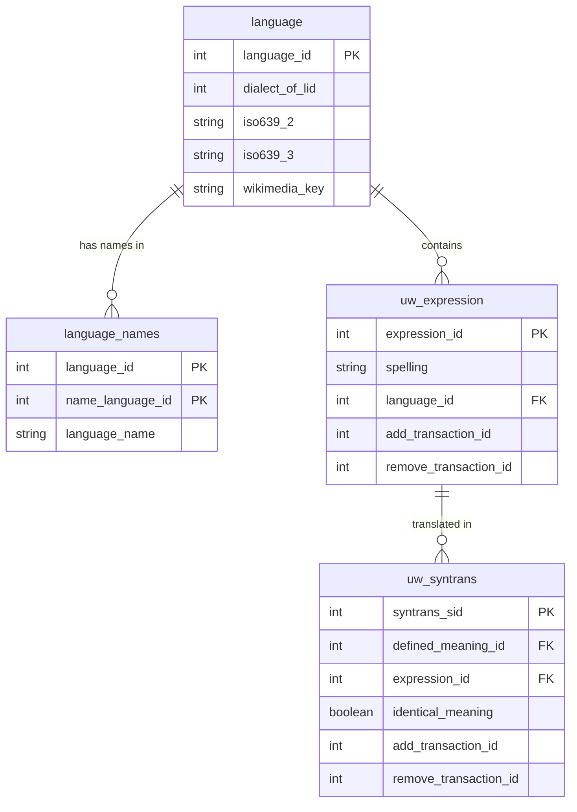

多言語辞書プロジェクト OmegaWiki の MySQL データベースダンプを SQLite で利用するためのアプローチについて解説します。

この記事では以下のリポジトリにあるスクリプトを使用します。

https://github.com/7shi/omegawiki-tools

# OmegaWiki

OmegaWiki はユーザー登録型の多言語辞書プロジェクトでしたが、既に終了しています。このプロジェクトでは、複数の言語間で単語の意味と翻訳が関連付けられています。

データは CC0 で提供されており、以下で再配布しています。

https://huggingface.co/datasets/n7shi/OmegaWiki

# 処理フロー

全体の処理フローは以下のようになります：

1. OmegaWikiのダンプファイル `omegawiki-lexical-20230530.sql.gz` を取得・展開
2. `sql2tsv.py` を使用して各テーブルの TSV ファイルを生成
3. `dump2sqlite.py` を使用して SQLite 互換の SQL を生成
4. SQLite で生成した SQL を実行して、データベース `omegawiki.db` を作成
5. `omegawiki.py` を使用して必要な多言語データを抽出

## MySQL ダンプの SQLite への変換

ローカルでのデータ利用には SQLite が手軽です。しかし MySQL には SQLite でサポートされていない構文（`AUTO_INCREMENT`、`CHARACTER SET` 指定など）やデータ型があるため、ダンプを直接インポートすることができません。

## SQL ダンプから TSV への変換

まず、テーブルに挿入されるデータを確認します。

`sql2tsv.py` は MySQL ダンプファイルから `INSERT` ステートメントを抽出し、テーブルごとに TSV ファイルに変換します。

- https://github.com/7shi/omegawiki-tools/blob/main/sql2tsv.py

このスクリプトの主な課題は SQL の `INSERT` 文を適切にパースすることです。特に文字列リテラル内のカンマやエスケープシーケンスを正しく処理するために、専用のパーサー関数を実装しています。

:::note info
1 文字ずつ処理していて遅くなると予想したため、当初は F# で実装していました。

- https://github.com/7shi/omegawiki-tools/blob/main/etc/sql2tsv.fsx

ほぼそのまま Python に移植したところ、Python 3.12 では F# よりも 1.5 倍程度高速でした。
:::

## SQLite 互換 SQL の生成

`dump2sqlite.py` は MySQL ダンプファイルを解析し、SQLite 互換の SQL スクリプトを生成します。

- https://github.com/7shi/omegawiki-tools/blob/main/dump2sqlite.py

主な処理内容：

1. MySQL 特有の構文を削除または置換
2. `INSERT` 文を SQLite の `.import` コマンドに変換
3. テーブル構造とインデックスの定義を SQLite 互換形式に変換

このスクリプトにより、先に生成した TSV ファイルを利用してデータをインポートすることが可能になります。データが分離されて SQL ファイルがコンパクトになるため、テーブル定義をエディタで確認するのが容易になります。

## 多言語データ抽出

`omegawiki.py` は変換されたデータベースからのデータ抽出を容易にするためのスクリプトです。

- https://github.com/7shi/omegawiki-tools/blob/main/omegawiki.py

データベース構造を抽象化するための関数を提供します。

| 関数名 | 説明 |
|--------|------|
| `language_id(name)` | 言語名や ISO 639 コード、Wikimedia キーから言語 ID を検索します。完全一致しない場合は前方一致を試みます。 |
| `language_name(lid, name_lid)` | 指定した言語IDの、指定した言語での名称を返します。見つからない場合は空文字を返します。 |
| `langcode(lid)` | 言語IDに対応するISO639-3コードとWikimediaキーのタプルを返します。 |
| `all_words(lid)` | 指定した言語のすべての単語（式IDと綴り）を返すカーソルを返します。 |
| `meaning_ids(xid)` | 指定した式IDに関連する意味IDのリストを返します。 |
| `get_words(mid, lid)` | 指定した意味IDと言語IDに対応する単語のリストを返します。 |

これらの関数は、OmegaWiki の SQLite データベースに対してクエリを実行し、多言語辞書データを効率的に検索・抽出するために使用されています。

```python:例
def get_words(mid, lid):
    return [str(row[0]) for row in cur.execute("""
        SELECT spelling FROM uw_syntrans
        INNER JOIN uw_expression ON uw_syntrans.expression_id = uw_expression.expression_id
        WHERE defined_meaning_id = ? AND language_id = ?
        """, (mid, lid))]
```



### 使用例

`omegawiki.py` の使用例として、ラテン語とイド語（エスペラント派生の人工言語）の辞書が含まれます。

- https://github.com/7shi/omegawiki-tools/tree/main/examples

以下のようにスクリプトを実行することで、多言語辞書を抽出できます：

```bash
python omegawiki.py db/omegawiki.db io eo la fr en ja > Ido.tsv
```

この例では、イド語 `io` の単語と、そのエスペラント `eo`、ラテン語 `la`、フランス語 `fr`、英語 `en`、日本語 `ja` への翻訳が含まれた TSV ファイルが生成されます。

例えば以下の行を見ると、1 つの単語に対して複数の訳語が対応付けられていることが分かります。これが OmegaWiki の特徴です。

Ido|Esperanto|lingua Latina|français|English|日本語
----|----|----|----|----|----
kolombo|; kolombo||colombe; colombe, pigeon|dove, pigeon; pigeon, dove|; 鳩

:::note warn
データベースを忠実に抽出することを目的としているため、重複を排除していません。また、必ずしもすべての言語の翻訳が揃うとは限りません。

重複を排除して余分なセミコロンを除去するには `-u` オプションを指定してください。
:::

## まとめ

本記事では、MySQL ダンプファイルを SQLite データベースに変換するためのアプローチについて解説しました。TSV を中間フォーマットとして活用することで、データの確認を容易にしています。

この手法は OmegaWiki の多言語辞書データ処理に特化していますが、その基本的な考え方は他のデータベース変換プロジェクトにも応用できるのではないでしょうか。
