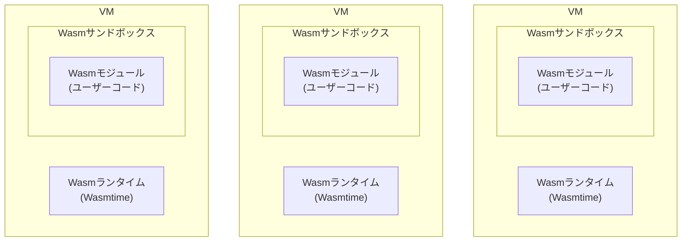
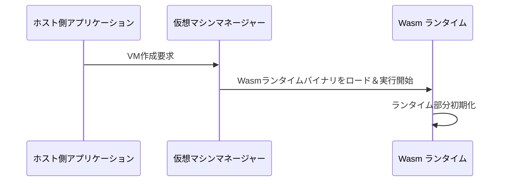
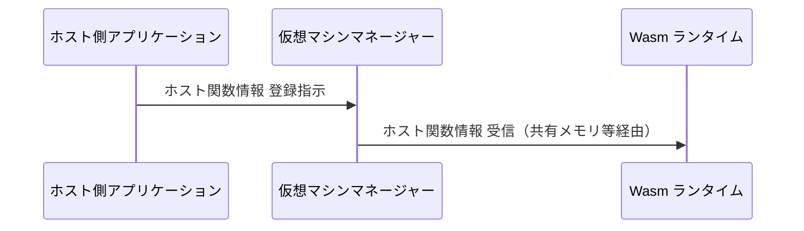
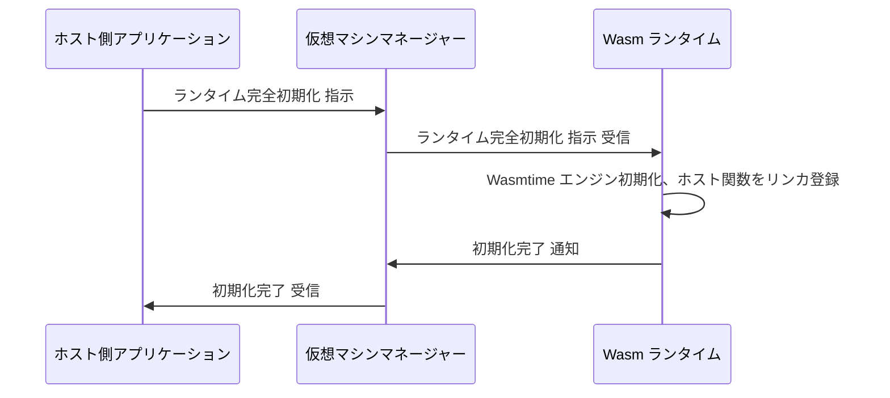
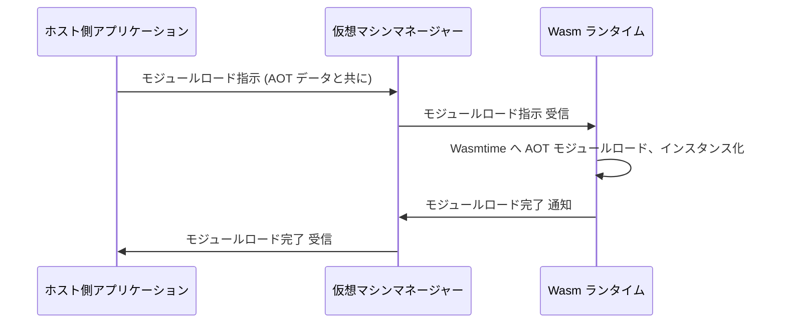
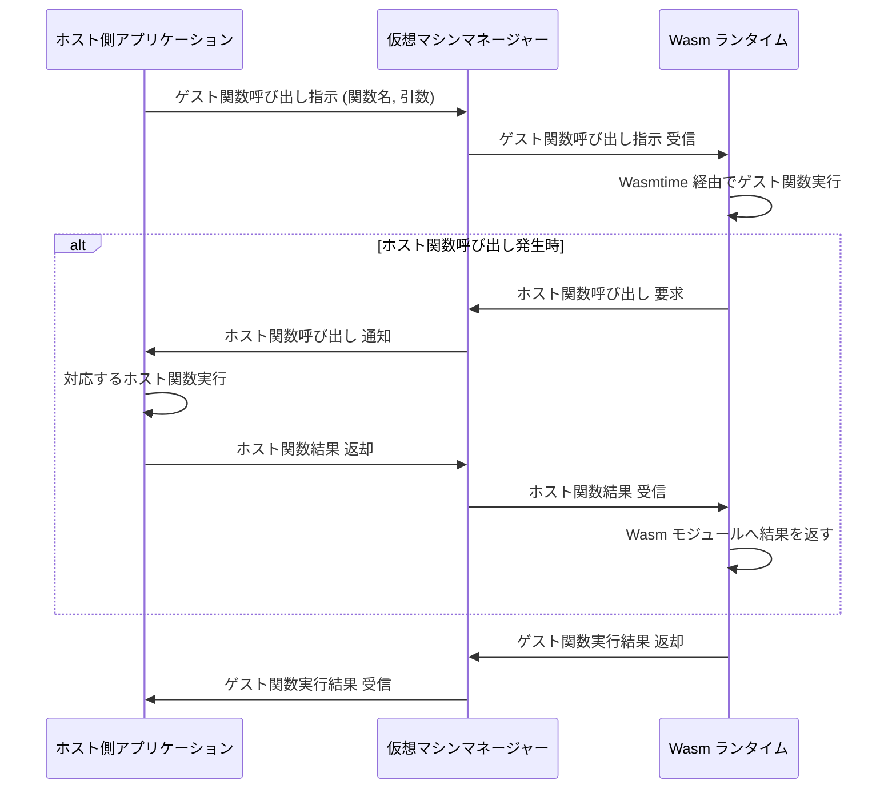
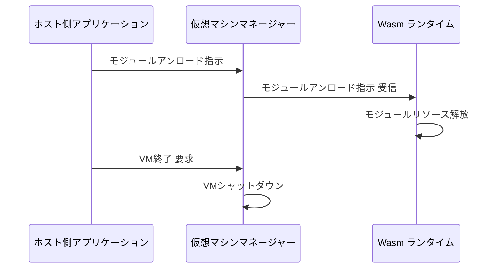

Hyperlight Wasm は、WebAssembly (Wasm) モジュールを軽量な VM ベースのサンドボックス内で安全に実行しながら、非常に低いレイテンシとオーバーヘッドを実現することを目的としています。

※ Claude 3.7 Sonnet と Gemini 2.5 Pro Experimental 03-25 でドキュメントとソースコードを調査しながらまとめた記事です。

# Hyperlight と Hyperlight Wasm

**Hyperlight** は、アプリケーション内に組み込むために設計された軽量な仮想マシンマネージャー (VMM) ライブラリです。信頼できないコードを**マイクロ VM** と呼ばれる極めて軽量なサンドボックス内で、非常に低いレイテンシと最小限のオーバーヘッドで安全に実行することを目的としています。Microsoft によって開発され、現在は Cloud Native Computing Foundation (CNCF) の Sandbox プロジェクトとしてオープンソースで開発が進められています。

https://github.com/hyperlight-dev/hyperlight

**Hyperlight Wasm** は、この Hyperlight VMM 技術を基盤とし、Wasm モジュールを実行することに特化したコンポーネントです。Wasm のポータビリティとセキュリティの利点を活かしつつ、Hyperlight のハードウェア仮想化による強力な分離と高速性を組み合わせることで、信頼できない第三者の Wasm コードを安全かつ効率的に実行する環境を提供します。

https://github.com/hyperlight-dev/hyperlight-wasm

# Hyperlight Wasm の特徴

Hyperlight Wasm 以下の特徴を持ちます。

1.  **マイクロ VM による強力な隔離:** ハイパーバイザーを利用したハードウェアレベルの分離。
2.  **ゲスト環境:** OS レスによる超低オーバーヘッドと高速起動（ミリ秒単位）。
3.  **二重のセキュリティ:** VM と Wasm ランタイムによる多層防御。
4.  **AOT コンパイル:** 事前コンパイルによる高速なモジュールロードと実行開始。
5.  **準仮想化 API:** ホスト関数呼び出しによる制御された機能拡張とホスト連携。WASI/Component Model を活用。



このアーキテクチャにより、セキュリティを最優先しつつ高いパフォーマンスと互換性を両立しており、特にサーバーレスコンピューティング、エッジコンピューティング、プラグインシステムなど、低レイテンシと強力な分離が求められるユースケースに適しています。

## マイクロ VM と OS レス環境

Hyperlight Wasm が利用するマイクロ VM は、複数のハイパーバイザーをサポートします。

*   Windows Hypervisor Platform (WHP) (Windows)
*   KVM (Linux)
*   Microsoft Hypervisor (mshv) (Azure Linuxなど)

VM ゲスト内部には Linux や Windows といった**汎用のオペレーティングシステムカーネルが存在しません**。代わりに、Wasm の実行とホストとの通信（準仮想化 API 経由）に特化した**最小限の専用ランタイム** (`wasm_runtime`) のみがロードされます。これにより、VMの起動時間の短縮と実行時のオーバーヘッドが大幅に削減され、通常のOSサービスには依存しません。

このランタイムは、Hyperlight のゲストライブラリ (`hyperlight_guest`等) を使用して `no_std` 環境向けにビルドされたバイナリです。内部に Wasmtime のような Wasm エンジンを含み、ユーザー Wasm モジュールのロード、実行、およびホストとの通信を仲介します。

## 高速起動と低オーバーヘッド

従来の VM が OS 全体のブートに数百ミリ秒を要するのに対し、Hyperlight マイクロ VM はカーネルレス設計により、**約 1〜2 ミリ秒**（将来的には 1 ミリ秒未満目標）という極めて高速な起動を実現します。これにより、以下の利点が生まれます。

*   リクエストごとのVM起動（インスタンスのアイドル不要）
*   メモリフットプリントの大幅な削減
*   より安価なハードウェアでの効率的な処理

## WASI とコンポーネントモデルによる互換性

Hyperlight Wasm は、OS に依存しないポータブルな実行環境を提供するために、以下の標準を活用します。

*   **WASI (WebAssembly System Interface):** ファイルアクセスやネットワークなどのシステム機能への標準インターフェースを提供します。
*   **WebAssembly Component Model:** 異なる言語で書かれたWasmモジュール間の相互運用性を高め、ホストとの型安全なインターフェース定義 (WIT: WebAssembly Interface Types) を可能にします。

これにより、開発者は`wasm32-wasip2`のような標準ターゲット向けにコードをコンパイルするだけで、Hyperlight Wasm を含む様々な Wasm 実行環境で動作させることが可能になります。C/Go/Rust のようなコンパイル言語だけでなく、Python/JavaScript のようなインタプリタ言語も、対応する Wasm ランタイムを同梱することで実行できます。

## 将来の展望

現時点では x86-64 アーキテクチャーのみサポートしています。将来的には Arm64 アーキテクチャーのサポートや、主要な WASI インターフェースのデフォルト実装の提供が計画されています。

# 準仮想化による機能拡張とセキュリティ

Hyperlight Wasm では、ネットワークアクセスやファイルシステム操作などのシステム機能は、VM ゲストが直接ハードウェアやホスト OS カーネルを叩くのではなく、**準仮想化**のメカニズムを通じて提供されます。

*   **仕組み:** Wasm コードは、ホスト側が事前に `ProtoWasmSandbox` に登録した**ホスト関数**を呼び出します。この呼び出しはVM内の `wasm_runtime` とハイパーバイザーの通信チャネルを経由してホスト側アプリケーションに伝えられ、ホスト側で実際の処理が実行されます。
*   **WASIサポート:** [src/wasm_runtime/src/wasip1.rs](https://github.com/hyperlight-dev/hyperlight-wasm/blob/main/src/wasm_runtime/src/wasip1.rs) に見られるように、WASI (WebAssembly System Interface) の一部（特に `wasi_snapshot_preview1` のサブセット）が限定的に実装されており、基本的なファイル操作などをホスト関数経由で利用可能です。しかし、現状では多くの WASI インターフェース（例: `wasi:sockets`）はデフォルト実装が提供されず、ホスト側アプリケーション開発者が自身で対応するホスト関数を実装・登録する必要があります。

準仮想化 API はホストとゲスト間の明確な接点となるため、設計や実装に不備があると攻撃経路（抜け道）になる可能性があります。Hyperlight Wasm では以下の方法でリスクを軽減しています。

*   **最小限の API:** デフォルトで公開される API を最小限に留める。
*   **厳格な定義 (WIT):** WIT による型安全なインターフェース定義。
*   **メモリ安全な言語 (Rust):** ホスト/ゲストランタイムの主要部分を Rust で実装。
*   **二重のサンドボックス:** VM と Wasm ランタイムによる多層防御。

# 実行方式: AOT コンパイル

Hyperlight Wasm では、Wasm コードの実行方法として、主に **AOT (Ahead-of-Time) コンパイル**が使用されます。

```bash:AOT コンパイル（例）
cargo run -p hyperlight-wasm-aot compile input.wasm output.aot
```

これは、内部で使用されている Wasmtime ランタイムがインタプリタ実行や VM 内での実行時コンパイル (JIT) をサポートしておらず、事前にマシンコードに変換されたバイナリを直接ロード・実行するように構成されているためです。これにより、VM 内での初期化時間とリソース消費を削減します。

# 実行フロー

Hyperlight Wasm はサンドボックスの状態を 3 つのコンポーネントで管理します。

* `ProtoWasmSandbox`: 初期状態のサンドボックスで、ホスト関数を登録するためのインターフェースを提供します。この段階ではWasmランタイムはまだロードされていません。
* `WasmSandbox`: Wasm ランタイムはロードされていますが、ユーザーコードはまだロードされていない状態のサンドボックスです。実行準備はまだ整っていません。
* `LoadedWasmSandbox`: Wasm ランタイムとユーザーコード（Wasm モジュール）の両方がロード済みで、関数実行の準備が整っている状態のサンドボックスです。

Wasm コードを実行するまでの流れを、フェーズごとに説明します。

## 事前準備フェーズ

1. ユーザーがホスト側アプリケーションに Wasm ファイルを提供します。
2. ホスト側アプリケーションは `hyperlight-wasm-aot` ツールを使用し、Wasm ファイルを AOT (Ahead-of-Time) コンパイルします。

## VM 起動フェーズ



1. ユーザーがホスト側アプリケーションにサンドボックス作成を要求します。
2. ホスト側アプリケーションが `SandboxBuilder::new()` を呼び出します。
3. `SandboxBuilder` が `build()` メソッドを呼び出し、`ProtoWasmSandbox` インスタンスを生成します。
4. 内部的に、`ProtoWasmSandbox` がハイパーバイザーに VM 作成を要求します。
5. ハイパーバイザーがマイクロ VM インスタンスを作成します。
6. ハイパーバイザーが VM に専用ゲストランタイムである `wasm_runtime` バイナリをロードします。
7. ハイパーバイザーが VM 内の `wasm_runtime` のエントリポイント (`hyperlight_main`) の実行を開始します。
8. VM 内の `wasm_runtime` が初期化処理を開始します（この時点ではまだ Wasmtime エンジンは完全に初期化されていません）。

## ホスト関数登録フェーズ



1. ホスト側アプリケーションが `ProtoWasmSandbox` の `register_host_func_X()` メソッドなどを呼び出します。
2. `ProtoWasmSandbox` が、登録するホスト関数の情報（名前、シグネチャ等）を、VM と共有されるメモリ領域などに書き込みます。
   *   ホストとゲスト間のインターフェース定義には WIT (WebAssembly Interface Types) が利用されます。

## ランタイム初期化フェーズ



1. ホスト側アプリケーションが `ProtoWasmSandbox` の `load_runtime()` メソッドを呼び出します。
2. `load_runtime()` は内部状態を遷移させ、新しい `WasmSandbox` インスタンスを返却します。
3. `WasmSandbox` がVM内の `wasm_runtime` に対して、ランタイム初期化（例: `InitWasmRuntime` 関数の呼び出し）を指示します。
4. VM 内の `wasm_runtime` が自身の持つ Wasmtime エンジンを初期化し、登録フェーズで共有されたホスト関数情報を Wasmtime リンカに登録します。
5. VM が `WasmSandbox` に対して初期化完了を通知します。

## モジュールロードフェーズ



1. ホスト側アプリケーションが `WasmSandbox` の `load_module()` メソッドに AOT コンパイル済みの Wasm バイナリパス（またはデータ）を渡して呼び出します。
2. `load_module()` は内部状態を遷移させ、新しい `LoadedWasmSandbox` インスタンスを返却します。
3. `WasmSandbox` が VM 内の `wasm_runtime` に対して、モジュールロードを指示し、AOT バイナリデータを渡します。
4. VM 内の `wasm_runtime` が Wasmtime エンジンに AOT バイナリをロードさせます。
5. Wasmtime エンジンがモジュールをインスタンス化し、インポート（ホスト関数など）を解決します。
6. VM が `LoadedWasmSandbox` に対してモジュールロード完了を通知します。

## 関数実行フェーズ



1. ホスト側アプリケーションが `LoadedWasmSandbox` の `call_guest_function()` メソッドなどを呼び出し、実行したい Wasm 関数名と引数を指定します。
2. `LoadedWasmSandbox` が VM 内の `wasm_runtime` に対して、指定されたゲスト関数の呼び出しを指示します。
3. `wasm_runtime` が Wasmtime エンジンを通じて、ロード済みの Wasm モジュール内の該当関数を実行します。
4. Wasm モジュールの実行中にホスト関数呼び出しが発生した場合:
   *   Wasm モジュールが Wasmtime を通じてホスト関数呼び出しを要求します。
   *   `wasm_runtime` がこの呼び出しを受け取り、準仮想化チャネルを通じてホスト側アプリケーションに通知します。
   *   ホスト側アプリケーションが対応する登録済みホスト関数を実行します。
   *   ホスト側アプリケーションが実行結果を VM 内の `wasm_runtime` に返却します。
   *   `wasm_runtime` が結果を Wasmtime エンジン経由で Wasm モジュールに返します。
5. Wasm モジュールが関数の実行を完了し、結果を `wasm_runtime` に返します。
6. `wasm_runtime` が準仮想化チャネルを通じて `LoadedWasmSandbox` に結果を返却します。
7. `LoadedWasmSandbox` がホスト側アプリケーションに結果を返却します。
8. ホスト側アプリケーションがユーザーに結果を表示または利用します。

## クリーンアップフェーズ



1. ホスト側アプリケーションが必要に応じて `LoadedWasmSandbox` の `unload_module()` を呼び出すと、モジュールリソースが解放されます。
2. ホスト側アプリケーションがサンドボックスの終了処理を呼び出すと、ハイパーバイザーに VM 終了が要求されます。
3. ハイパーバイザーがマイクロ VM をシャットダウンします。

# 参考

以下のポストで Hyperlight Wasm の存在を知りました。

<blockquote class="twitter-tweet"><p lang="ja" dir="ltr">ウオー wasm vm で docker すっとばせる！<a href="https://t.co/UKYTyp2tf4">https://t.co/UKYTyp2tf4</a></p>&mdash; mizchi (@mizchi) <a href="https://twitter.com/mizchi/status/1906741895168221238?ref_src=twsrc%5Etfw">March 31, 2025</a></blockquote> <script async src="https://platform.twitter.com/widgets.js" charset="utf-8"></script> 

このポストからリンクされている記事を参考にしました。

https://opensource.microsoft.com/blog/2025/03/26/hyperlight-wasm-fast-secure-and-os-free/
