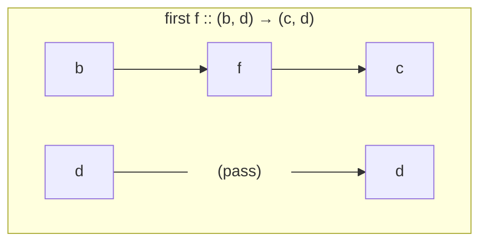
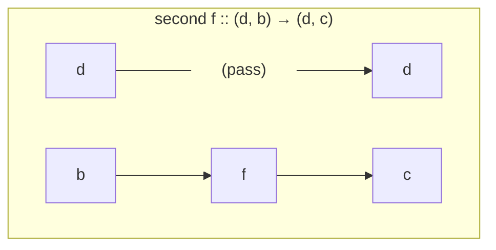
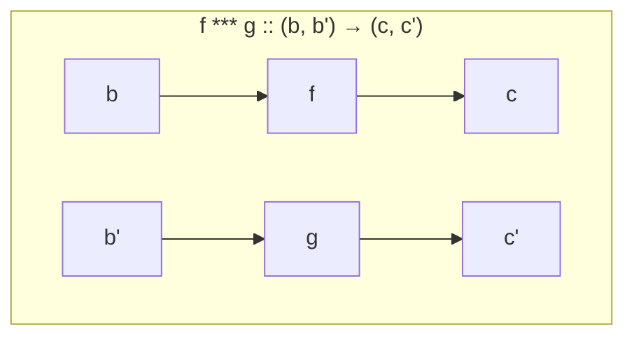
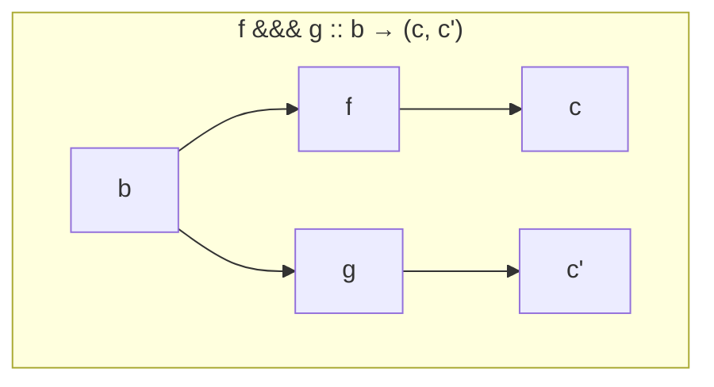

アローは入力から出力への計算そのものを型として扱い、関数合成を一般化した枠組みです。モナドと違って次の計算を値から選べない代わりに、組み立てた時点で計算の形が決まります。実行前に中身を調べられるパーサーを作りながら、その違いを説明します。

:::message
本記事の執筆には Claude Code (Opus 5) を利用しました。
:::

シリーズの記事です。

1. [Haskell 超入門](http://qiita.com/7shi/items/145f1234f8ec2af923ef)
1. [Haskell 代数的データ型 超入門](http://qiita.com/7shi/items/1ce76bde464b4a55c143)
1. [Haskell アクション 超入門](http://qiita.com/7shi/items/85afd7bbd5d6c4115ad6)
1. [Haskell ラムダ 超入門](http://qiita.com/7shi/items/1345bf32003faff435cb)
1. [Haskell アクションとラムダ 超入門](http://qiita.com/7shi/items/4a8a2807bb5186576c61)
1. [Haskell IOモナド 超入門](http://qiita.com/7shi/items/d3d3492ddd90d47160f2)
1. [Haskell リストモナド 超入門](http://qiita.com/7shi/items/deb19c4cba933590ffbf)
1. [Haskell Maybeモナド 超入門](http://qiita.com/7shi/items/c7d7eec066af0fe0688d)
1. [Haskell 状態系モナド 超入門](http://qiita.com/7shi/items/2e9bff5d88302de1a9e9)
1. [Haskell モナド変換子 超入門](http://qiita.com/7shi/items/4408b76624067c17e933)
1. [Haskell 例外処理 超入門](http://qiita.com/7shi/items/73e534c47bbebc71b37e)
1. [Haskell 構文解析 超入門](http://qiita.com/7shi/items/b8c741e78a96ea2c10fe)
1. [Haskell 継続モナド 超入門](https://zenn.dev/7shi/articles/20260803-haskell-continuation-monad)
1. [Haskell 型クラス 超入門](https://zenn.dev/7shi/articles/20260805-haskell-type-classes)
1. [Haskell モナドとゆかいな仲間たち](https://zenn.dev/7shi/articles/20260807-haskell-monads-and-friends)
1. [Haskell Freeモナド 超入門](https://zenn.dev/7shi/articles/20260808-haskell-free-monad)
1. [Haskell Operationalモナド 超入門](https://zenn.dev/7shi/articles/20260809-haskell-operational-monad)
1. [Haskell Effモナド 超入門](https://zenn.dev/7shi/articles/20260811-haskell-eff-monad)
1. **Haskell アロー 超入門** ← この記事

# 関数合成を一般化する

関数を `.` でつなぐと、2 つの関数を 1 つの関数にまとめられました。👉[ラムダ](https://qiita.com/7shi/items/1345bf32003faff435cb#関数合成)

`Control.Arrow` には、同じことを左から右へ書く `>>>` があります。

```hs
import Control.Arrow

f, g :: Int -> Int
f x = x + 1
g x = x * 2

main :: IO ()
main = do
    print $ (f . g) 1
    print $ (g >>> f) 1
```
```text:実行結果
3
3
```

`f . g` は「`g` を適用してから `f`」でしたが、`g >>> f` は書いた順に読めます。

:::message
今回のコードはすべて `runghc` で動きます。使うのは base に同梱されている `Control.Arrow` だけで、外部パッケージは不要です。
:::

## Category

`>>>` の土台にあるのが `Category` 型クラスです。`Control.Category` にあります。この型クラスのインスタンスにするとは、その型を「つなげられるもの」という観点で括ることにあたります。中身がまるで違う型でも、この観点から見る限りは同じように扱えます。

```hs
class Category cat where
    id  :: cat a a
    (.) :: cat b c -> cat a b -> cat a c
```

`id` と `.` という名前のとおり、関数の恒等関数と関数合成をそのまま型クラスにしたものです。関数 `(->)` はこのインスタンスで、中身は Prelude の `id`・`.` そのものです。

```hs
instance Category (->) where
    id x = x
    g . f = \x -> g (f x)
```

`>>>` は `Category` のメソッドではなく、`.` を使って定義された別の関数です。`.` の引数の順を入れ替えただけなので、`.` さえインスタンスで定義すれば自動的に使えます。

```hs
(>>>) :: Category cat => cat a b -> cat b c -> cat a c
f >>> g = g . f
```

なお、自分で `instance Category` を書くときは、Prelude の `id`・`.` と名前が衝突するので、Prelude 側を隠す必要があります。

```hs
import Control.Category
import Prelude hiding ((.), id)
```

使うだけなら `Control.Category` を import しなくても構いません。`Control.Arrow` が `>>>` と `<<<`（向きが逆のもの）を再エクスポートしているためです。

### 単位元

`(->)` の `id` は引数をそのまま返すだけなので、どちらから合成しても相手の関数は変わりません。

```hs
id >>> f = f
f >>> id = f
```

このように、合成しても相手を変えない要素を**単位元**と呼びます。数の足し算における 0、掛け算における 1 と同じ位置づけです。

`Category` が `id` に求めているのはこの性質です。恒等関数であることが求められているわけではありません。`(->)` では単位元がたまたま恒等関数になっているだけで、他のインスタンスでは別の形になります。

## Kleisli

`>>>` でつなげられるのは `(->)` だけではありません。

モナドを返す関数（`a -> m b` の形）も関数なので、`(->)` として `>>>` でつなぐこと自体はできます。しかしその場合、次につなげるのは `m b` を受け取る関数に限られます。`m` が付いたまま渡されるためです。`a -> m b` と `b -> m c` のように、モナドを剥がしながらつなぐには別のインスタンスが必要です。

そのために用意されているのが `Kleisli` です。`a -> m b` の形の関数を包む newtype で、これを `Category` のインスタンスにすることで、`>>>` が前の結果からモナドを剥がして次に渡す動作になります。

```hs
newtype Kleisli m a b = Kleisli { runKleisli :: a -> m b }
```

`(->)` が `Category` のインスタンスだったのと同じく、`Kleisli m` にも `Category` のインスタンスが用意されています。

```hs
instance Monad m => Category (Kleisli m) where
    id = Kleisli return
    Kleisli g . Kleisli f = Kleisli (\x -> f x >>= g)
```

`.` の中身は `\x -> f x >>= g` です。前の計算の結果を `>>=` で次の計算に渡すので、`>>>` でつなぐと `Maybe` の失敗が後ろに伝わるといった、モナドとしての振る舞いがそのまま働きます。これはモナド則を書き直したときに出てきた `>=>` と同じものです。👉[モナドとゆかいな仲間たち](https://zenn.dev/7shi/articles/20260807-haskell-monads-and-friends#-で書き直す)

### 単位元

`id :: cat a a` を `Kleisli m` に当てはめると `Kleisli m a a`、つまり中身は `a -> m a` という関数です。`Kleisli` が包む関数は必ず `a -> m b` の形なので、`(->)` のときのような恒等関数 `\a -> a`（型は `a -> a`）では型が合いません。

代わりに `return` が単位元になります。`>>>` でつなぐと `.` の定義により `>>=` が現れますが、モナド則がそれを打ち消すためです。

```hs
Kleisli return >>> Kleisli f  -- 中身は \x -> return x >>= f = f x
Kleisli f >>> Kleisli return  -- 中身は \x -> f x >>= return = f x
```

どちらも `Kleisli f` に戻るので、`id` は `return` を包んだものになります。

```hs
id = Kleisli return
```

`return` は値を `m` で包むので、恒等関数のように値をそのまま返すわけではありません。`id` という名前から恒等関数を思い浮かべますが、そうなるのは `Category (->)` のときだけです。`Category` が定めているのは単位元という性質だけで、それが何になるかはインスタンス次第です。

### 動作確認

文字列を数値にする `parse` と、偶数なら半分にする `half` を `Maybe` でつないでみます。どちらも失敗する可能性のある関数です。👉[Maybeモナド](https://qiita.com/7shi/items/c7d7eec066af0fe0688d#maybeモナド)

```hs
import Control.Arrow
import Control.Monad ((>=>))

parse :: String -> Maybe Int
parse s = if not (null s) && all (`elem` "0123456789") s
          then Just (read s) else Nothing

half :: Int -> Maybe Int
half n = if even n then Just (n `div` 2) else Nothing

main :: IO ()
main = do
    print $ (parse >=> half) "10"
    print $ (parse >=> half) "7"
    print $ runKleisli (Kleisli parse >>> Kleisli half) "10"
    print $ runKleisli (Kleisli parse >>> Kleisli half) "7"
```
```text:実行結果
Just 5
Nothing
Just 5
Nothing
```

`>=>` と `>>>` が同じ結果を返しています。`Kleisli` は `>=>` に別の見た目を与えたものです。

ここまでで分かるのは、普通の関数とモナドを返す関数という別種のものが、`>>>` という同じ形でつながるということです。この「つなげる」を型クラスにしたのが `Category` で、その上に部品を足したものがアローです。

# Arrow

**アロー**（arrow）は、入力から出力への計算を表す型です。`Arrow` 型クラスのインスタンスとして定義します。`a b c` と書いたとき、`b` が入力の型、`c` が出力の型です。

```hs
class Category a => Arrow a where
    arr    :: (b -> c) -> a b c
    first  :: a b c -> a (b, d) (c, d)
    second :: a b c -> a (d, b) (d, c)
    (***)  :: a b c -> a b' c' -> a (b, b') (c, c')
    (&&&)  :: a b c -> a b  c' -> a b (c, c')
```

スーパークラスが `Category` なので、`Arrow` のインスタンスを書くには `Category` のインスタンスも必要です。👉[型クラス](https://zenn.dev/7shi/articles/20260805-haskell-type-classes#スーパークラス)

`arr` はただの関数をアローに持ち上げる関数です。Free モナドの `liftF` や Operational モナドの `singleton` と同じ位置付けです。👉[Freeモナド](https://zenn.dev/7shi/articles/20260808-haskell-free-monad#liftf) 👉[Operationalモナド](https://zenn.dev/7shi/articles/20260809-haskell-operational-monad#継続を命令の型から外す)

残りの 4 つのうち、インスタンスで実際に定義が必要なのは `first` だけです。`second`・`***`・`&&&` は `arr` と `first` から導けるため、既定の実装が用意されています。

## 配線

関数 `(->)` は `Arrow` のインスタンスなので、そのまま試せます。`arr` を確認します。

```text:GHCi
ghci> import Control.Arrow
ghci> arr ((+ 1) :: Int -> Int) 1
2
```

ただ関数を適用しただけです。`arr` はアローの世界に持ち上げるだけで、計算そのものは変えません。

`first`・`second`・`***`・`&&&` の型に共通するのはタプルです。アローではタプルが配線にあたり、2 つの値を並べて流す線を表します。1 つずつ見ていきます。

`first` はアロー `f` を受け取り、新しいアロー `first f` を返す関数です。

```hs
first ::  a b    c  -> a (b, d)    (c, d)
first (f :: b -> c) ::   (b, d) -> (c, d)
```

`a b c` を `f :: b -> c` とみると `a (b, d) (c, d)` は `first f :: (b, d) -> (c, d)` になります。以下の図では `first f` の配線を示します。

`f` はタプルの 1 本目だけに適用され、2 本目はそのまま素通りします。



```text:GHCi
ghci> first ((+ 1) :: Int -> Int) (1, "x")
(2,"x")
```

`second` は逆に 2 本目だけに関数を通し、1 本目をそのまま流します。



```text:GHCi
ghci> second ((+ 1) :: Int -> Int) ("x", 1)
("x",2)
```

`***` は 2 本の線をそれぞれ別の関数に通します。1 本目は `f`、2 本目は `g` という具合に、線ごとに違う計算を並べて走らせます。



```text:GHCi
ghci> (((+ 1) :: Int -> Int) *** show) (3, 4)
(4,"4")
```

`&&&` は 1 本の入力を 2 方向に分岐させ、それぞれ別の関数に通してからタプルにまとめます。入力は 1 つですが、結果は 2 つの計算を両方経由した値になります。



```text:GHCi
ghci> (((+ 1) :: Int -> Int) &&& (* 2)) 3
(4,6)
```

これを使えば、リストの平均が計算の流れとして書けます。

```hs
import Control.Arrow

mean :: [Double] -> Double
mean = (sum &&& (fromIntegral . length)) >>> uncurry (/)

main :: IO ()
main = print $ mean [1, 2, 3, 4]
```
```text:実行結果
2.5
```

入力のリストを `&&&` で 2 方向に分け、片方で合計、片方で個数を求めて、タプルを `uncurry (/)` で割り算に渡しています。引数の名前が 1 つも出てきません。

## 練習

【問1】`mean` に倣って、リストの最大値と最小値の差を求める `spread` を `&&&` で書いてください。

```hs
import Control.Arrow

spread :: [Int] -> Int
spread = undefined      -- ここを書く

main :: IO ()
main = print $ spread [3, 1, 4, 1, 5]
```
```text:実行結果
4
```

:::details 解答例
```hs
spread :: [Int] -> Int
spread = (maximum &&& minimum) >>> uncurry (-)
```

`mean` と同じ形です。`&&&` で 2 方向に分け、`uncurry` で 2 引数の関数に渡します。
:::

# proc 記法

`>>>` と `&&&` だけで配線を書くと、線が増えたときに読みにくくなります。`do` に相当する記法として **proc 記法**が用意されています。使うには言語拡張 `Arrows` が必要です。

```hs
{-# LANGUAGE Arrows #-}
import Control.Arrow

mean :: [Double] -> Double
mean = proc xs -> do
    s <- sum -< xs
    n <- length -< xs
    returnA -< s / fromIntegral n

main :: IO ()
main = print $ mean [1, 2, 3, 4]
```
```text:実行結果
2.5
```

`&&&` で書いたものと同じ結果です。読み方は次のようになります。

|書き方|意味|
|---|---|
|`proc x -> ...`|入力を `x` という名前で受け取る|
|`y <- f -< x`|アロー `f` に入力 `x` を流し、出力を `y` とする|
|`returnA -< e`|`e` を出力にする|

`-<` の左がアロー、右が入力です。`do` の `<-` によく似ていますが、決定的な違いがあります。`-<` の左側には、`proc` で受け取った値を書けません。 上の例で `s` や `n` を使えるのは `-<` の右側だけです。

つまり、どのアローを使うかは書いた時点で決まっていて、流れてくる値によって選び直すことができません。

:::message
`mean` は `&&&` で書ける程度の単純な例なので、`proc` のメリットはまだ実感しにくいかもしれません。分岐で配線が込み入る例は、後述の[分岐](#分岐)節のパーサー `ab` で登場します。
:::

`proc` で書いたものは `arr`・`>>>`・`&&&` の組み合わせに展開されます。書けるものが増えるわけではなく、書き方が変わるだけです。シリーズで使ってきた言語拡張と並べると位置づけがはっきりします。

|回|拡張|種類|
|---|---|---|
|Free|`DeriveFunctor`|便利のため、定型を書かなくても済む|
|Operational|`GADTs`|表現力のため、書けないものが書ける|
|アロー|`Arrows`|構文のため、書き方が変わる|

## 練習

【問2】問1の `spread` を proc 記法で書き直してください。

```hs
{-# LANGUAGE Arrows #-}
import Control.Arrow

spread :: [Int] -> Int
spread = undefined      -- ここを書く

main :: IO ()
main = print $ spread [3, 1, 4, 1, 5]
```
```text:実行結果
4
```

:::details 解答例
```hs
spread :: [Int] -> Int
spread = proc xs -> do
    mx <- maximum -< xs
    mn <- minimum -< xs
    returnA -< mx - mn
```

`&&&` で 2 方向に分けていたものが、2 行の `<-` になりました。同じ配線を 2 通りの書き方で表せます。
:::

# アローを自作する

ここまでは関数と `Kleisli` という既製のインスタンスを使ってきました。ここからは自分でアローを作ります。題材はパーサーです。

## 静的パーサー

パーサーコンビネーターでは、パーサーを `>>=` でつないで大きなパーサーを組み立てました。文字列を受け取って、結果と残りの文字列を返す関数がパーサーの正体です。👉[構文解析](https://qiita.com/7shi/items/b8c741e78a96ea2c10fe#動作原理)

この方式では、組み立てたパーサーが何を受け付けるのかは、実際に文字列を与えてみるまで分かりません。今回作るのは、合成した時点で受け付ける文字が分かるパーサーです。

たとえば `abc = char 'a' >>> char 'b' >>> char 'c'` のように 1 文字ずつ読むパーサーをつなげて `abc` を作ったとします。実装できれば、`expects abc` は 1 文字も解析せずに `"abc"` を返し、`runP abc "abcd" ()` は実際に解析して `Just ((),"d")` を返せるようになります。

パーサーを組み立てた時点で、実際に解析せずに「このパーサーは何を受け付けるか」に答えられるようにするには、解析を実行する関数とは別に、受け付ける文字の情報を静的なデータとして持ち歩く必要があります。`>>>` でつないだときにこの情報どうしも一緒に合成されれば、組み立てが終わった時点で全体が受け付ける文字が分かる、という設計です。

型はタプルで、この 2 つを同時に持ちます。

```hs
newtype P b c = P ([Char], [Char] -> b -> Maybe (c, [Char]))
```

タプルの左の `[Char]` が静的な情報で、このパーサーが受け付ける文字を並べたものです。右が実際の解析で、解析対象の文字列 `[Char]` と入力値 `b` を受け取り、成功すれば出力値 `c` と残りの文字列 `[Char]` を返します。失敗は `Nothing` で表します。この 2 つは独立していて、左を見るだけなら右の関数を一切呼び出しません。

`Category` のインスタンスが要点です。`>>>` でつないだときに、この静的な情報がどう合成されるかを決めるからです。

```hs
instance Category P where
    id = P ([], \s b -> Just (b, s))
    P (t2, g) . P (t1, f) = P (t1 ++ t2, \s b -> f s b >>= \(x, s') -> g s' x)
```

`id` は「何もしないパーサー」です。静的な情報は空リストで、何も消費しません。実際の関数も、受け取った値 `b` をそのまま残りの文字列 `s` と組にして返すだけです。

`.` は `g . f`、つまり `f` を先に `g` を後に実行する合成です。静的な情報は `t1 ++ t2` で連結されます。ここが今回の要点です。実際の関数を一切呼ばずに、リストをつなげるだけで「`f` が受け付ける文字の次に `g` が受け付ける文字が来る」という情報を作れています。実際の関数のほうは、`f s b` で 1 つ目のパーサーを走らせ、成功すれば残りの文字列 `s'` と結果 `x` を取り出して `g s' x` に渡すだけです。こちらは実際に実行しないと結果が分かりません。

`Arrow` のインスタンスは `arr` と `first` の 2 つを書きます。

```hs
instance Arrow P where
    arr f = P ([], \s b -> Just (f b, s))
    first (P (t, f)) = P (t, \s (b, d) -> fmap (\(c, s') -> ((c, d), s')) (f s b))
```

`arr` はただの関数 `f :: b -> c` をアローに持ち上げます。文字列を読まずに値を変換するだけなので、消費する文字はなく、静的な情報は空リストです。

`first` はタプルの片方 `b` だけをアロー `f` に通し、もう片方 `d` はそのまま横に流します。`d` は読み飛ばすだけで解析には関与しないので、静的な情報は元の `t` のまま変わりません。実際の関数は `f s b` で `b` を処理し、その結果 `c` と `d` を組にして返します。

指定した 1 文字を読むパーサーと、2 つの取り出し関数を用意します。

```hs
char :: Char -> P () ()
char c = P ([c], \s _ -> case s of
    (x:xs) | x == c -> Just ((), xs)
    _               -> Nothing)

expects :: P b c -> [Char]
expects (P (t, _)) = t

runP :: P b c -> [Char] -> b -> Maybe (c, [Char])
runP (P (_, f)) s b = f s b
```

`expects` が静的な情報を取り出す関数、`runP` が実際に走らせる関数です。全体をまとめます。

```hs
import Control.Arrow
import Control.Category
import Prelude hiding ((.), id)

newtype P b c = P ([Char], [Char] -> b -> Maybe (c, [Char]))

instance Category P where
    id = P ([], \s b -> Just (b, s))
    P (t2, g) . P (t1, f) = P (t1 ++ t2, \s b -> f s b >>= \(x, s') -> g s' x)

instance Arrow P where
    arr f = P ([], \s b -> Just (f b, s))
    first (P (t, f)) = P (t, \s (b, d) -> fmap (\(c, s') -> ((c, d), s')) (f s b))

char :: Char -> P () ()
char c = P ([c], \s _ -> case s of
    (x:xs) | x == c -> Just ((), xs)
    _               -> Nothing)

expects :: P b c -> [Char]
expects (P (t, _)) = t

runP :: P b c -> [Char] -> b -> Maybe (c, [Char])
runP (P (_, f)) s b = f s b

abc :: P () ()
abc = char 'a' >>> char 'b' >>> char 'c'

main :: IO ()
main = do
    print $ expects abc
    print $ runP abc "abcd" ()
    print $ runP abc "abd" ()
```
```text:実行結果
"abc"
Just ((),"d")
Nothing
```

1 行目が今回の主眼です。`abc` を走らせる前に、それが `"abc"` を受け付けるパーサーだと分かっています。2 行目は成功して `"d"` が残った結果、3 行目は失敗です。

パーサーコンビネーターでは、こういう問い合わせはできませんでした。`>>=` でつないだ先には関数が入っていて、その中身は実行してみないと見えないからです。

## 練習

【問3】文字列をそのまま受け付ける `string` を書いてください。`char` を並べてつなぐだけです。

```hs
string :: [Char] -> P () ()

main :: IO ()
main = do
    print $ expects (string "abc")
    print $ runP (string "abc") "abcd" ()
```
```text:実行結果
"abc"
Just ((),"d")
```

:::details 解答例
```hs
string :: [Char] -> P () ()
string s = foldr (>>>) id (map char s)
```

各文字を `char` に変えて `>>>` で畳み込みます。初期値の `id` は `Control.Category` のもので、何も消費せず入力をそのまま返すパーサーです。

`expects` が `"abc"` になるのは、`Category` の `.` が静的な情報を `++` で連結しているからです。畳み込みの回数が増えても、連結されていくだけです。
:::

# 分岐

順につなぐだけでなく、分かれ道も書きたくなります。proc 記法の中で `if` を使ってみると、`ArrowChoice` のインスタンスが必要だと言われます。

```hs
class Arrow a => ArrowChoice a where
    left  :: a b c -> a (Either b d) (Either c d)
    (|||) :: a b d -> a c d -> a (Either b c) d
    (+++) :: a b c -> a b' c' -> a (Either b b') (Either c c')
```

`Arrow` がタプルで 2 本の線を並べていたのに対して、`ArrowChoice` は `Either` でどちらか一方を選びます。定義が必要なのは `left` だけです。

```hs
instance ArrowChoice P where
    left (P (t, f)) = P (t, \s e -> case e of
        Left  b -> fmap (\(c, s') -> (Left c, s')) (f s b)
        Right d -> Just (Right d, s))
```

`Left` なら中のパーサーに通し、`Right` ならそのまま素通しします。静的な情報は元のままです。

これで proc の中に `if` が書けます。

```hs
ab :: P Bool ()
ab = proc flag -> if flag then char 'a' -< () else char 'b' -< ()
```

`proc` を使わず同じ型で書くと、`if` の分岐を先に `Either` へ詰め替える手間が要ります。

```hs
ab' :: P Bool ()
ab' = arr (\flag -> if flag then Left () else Right ()) >>> (char 'a' ||| char 'b')
```

`ab` の `if` はそのまま `Bool` を見て分岐できますが、`ab'` は `|||` が `Either` しか受け取らないので、`arr` で `Bool` を `Either` に変換する行が余分に必要です。線が増えるほど、この変換の積み重ねが読みにくさに直結します。`proc` の記法はこの変換を裏で肩代わりしています。

`|||` を使って直接書くこともできます。分岐の条件を `Either` として外から受け取る形です。

```hs
ab2 :: P (Either () ()) ()
ab2 = char 'a' ||| char 'b'
```

走らせてみます。

```hs
main :: IO ()
main = do
    print $ expects ab
    print $ runP ab "ab" True
    print $ runP ab "ab" False
    print $ expects ab2
    print $ runP ab2 "ab" (Left ())
    print $ runP ab2 "ba" (Right ())
```
```text:実行結果
"ab"
Just ((),"b")
Nothing
"ab"
Just ((),"b")
Just ((),"a")
```

1 行目に注目してください。`expects ab` が `"ab"` を返しています。分岐しても静的な情報は取れます。 両方の枝の和になるので、`flag` の値がどちらに転んでも、起こりうることの全体は事前に分かります。

`flag` が実際に決まるのは実行時ですが、そのとき何が選ばれうるかは組み立てた時点で確定しているわけです。

# モナドにはできない

ここまで来ると、`P` をモナドにすればもっと自由に書けるのではないか、と思えてきます。実際に書こうとすると詰まります。

`>>=` にあたる関数の型を書き下してみます。

```hs
bindP :: P b c -> (c -> P b d) -> P b d
```

第 2 引数の `k` は、解析結果 `c` を受け取って次のパーサーを返す関数です。結果の `P b d` を作るには、まず静的な情報、つまり `[Char]` の値を用意しなければなりません。

そこに何を書けばよいでしょうか。1 つ目のパーサーの分は取り出せますが、2 つ目のパーサーは `k` を適用しないと手に入りません。`k` を適用するには引数として `c` が必要です。そして `c` は解析を実行して初めて手に入る値です。

組み立てている時点では、解析対象の文字列すら渡されていません。静的な情報を作るために実行結果が必要というのは、順番が逆です。ここで行き詰まります。

`>>=` の自由さは、まさにここから来ています。次の計算を結果の値から選べるからこそ、組み立てた時点では次に何が来るか分かりません。アローの `>>>` はこの選択を持たないので、逆に全体の形が先に決まります。

## app を足すと書けてしまう

「選べない」のがアローの制約ですが、これを外す型クラスが用意されています。`ArrowApply` です。

```hs
class Arrow a => ArrowApply a where
    app :: a (a b c, b) c
```

入力としてアローそのものと値を受け取り、そのアローを走らせます。アローが値として流れてくるので、流れてきた値によって次の計算を選べます。

`P` に実装してみます。

```hs
instance ArrowApply P where
    app = P ([], \s (P (_, f), b) -> f s b)
```

これは書けてしまいます。ただし静的な情報の欄に書けるものがありません。実行時に受け取ったパーサーを走らせるので、組み立て時点では何を消費するのか言えず、空にするしかないからです。

これを使うと、入力の値によって使うパーサーを選べます。

```hs
choose :: P Bool ()
choose = arr (\flag -> (if flag then char 'a' else char 'b', ())) >>> app

main :: IO ()
main = do
    print $ expects choose
    print $ runP choose "ab" True
    print $ runP choose "ba" True
```
```text:実行結果
""
Just ((),"b")
Nothing
```

1 行目が嘘になっています。`expects choose` は「何も受け付けない」と答えるのに、2 行目では実際に `'a'` を消費して `"b"` が残っています。3 行目は先頭が `'a'` でないので失敗します。

型エラーにはならないので、正確に言えば「モナドにできない」のではなく、モナドにすると静的な情報が意味を失うということです。実行前に調べられるという利点は、`>>=` にあたる操作を持たないことと引き換えに得られています。

## 静的と動的

同じことは既に見た `Kleisli` にも当てはまります。`Kleisli m` はモナドから作ったアローなので、`app` を持ちます。モナドがあれば「値を取り出して次を選ぶ」ができるからです。アローとして書いても、静的な情報は取れません。

型クラスの階層と並べると位置づけが見えます。👉[モナドとゆかいな仲間たち](https://zenn.dev/7shi/articles/20260807-haskell-monads-and-friends#applicative)

|型クラス|次の計算を値から選べるか|
|---|---|
|`Applicative`|選べない。`<*>` は両側を先に決めてから組み合わせる|
|`Arrow`|選べない。`>>>` は組み立てた時点で全体が決まる|
|`Monad`|選べる。`>>=` の右辺は値を受け取る関数|
|`ArrowApply`|選べる。`app` でアローそのものを流せる|

上 2 つが静的、下 2 つが動的です。アローは `Applicative` の側にいて、`ArrowApply` を足すと `Monad` の側に移ります。

:::message
理論の上では `ArrowApply` を持つアローとモナドは互いに行き来できることが知られていますが、今回は立ち入りません。実感として押さえておきたいのは、`app` を足すと静的な利点が消えるという一点です。
:::

## 練習

【問4】入口で見た `parse` と `half` を `Kleisli` でつないでパイプラインを作り、さらに `app` で値によって次のアローを選んでください。

```hs
pipeline :: Kleisli Maybe String Int
choose   :: Kleisli Maybe Int Int

main :: IO ()
main = do
    print $ runKleisli pipeline "10"
    print $ runKleisli pipeline "7"
    print $ runKleisli choose 8
    print $ runKleisli choose (-8)
    print $ runKleisli choose 7
```
```text:実行結果
Just 50
Nothing
Just 4
Just 8
Nothing
```

`pipeline` は解析して半分にしてから 10 倍します。`choose` は正なら半分にし、負なら符号を反転します。

:::details 解答例
```hs
import Control.Arrow

parse :: String -> Maybe Int
parse s = if not (null s) && all (`elem` "0123456789") s
          then Just (read s) else Nothing

half :: Int -> Maybe Int
half n = if even n then Just (n `div` 2) else Nothing

pipeline :: Kleisli Maybe String Int
pipeline = Kleisli parse >>> Kleisli half >>> arr (* 10)

choose :: Kleisli Maybe Int Int
choose = arr (\n -> (if n > 0 then Kleisli half else arr negate, n)) >>> app
```

`pipeline` は失敗しうる関数とただの関数が `>>>` で混ざっています。ただの関数は `arr` で持ち上げます。

`choose` は `P` に `app` を入れたときと同じ形です。`arr` で「使うアローと入力値」のタプルを作り、`app` に流します。`-8` が `Just 8` になっているとおり、負のときは `half` を通らず反転だけしています。モナドから作ったアローは、値によって次を選べる側にいます。
:::

# アローの現在

アローは主流の書き方ではありません。実際にアローとして設計されたライブラリは限られています。

一方で、`Control.Arrow` の演算子自体は広く使われています。`&&&`・`***`・`first`・`second` は、アローの文脈と関係なく、タプルを扱う便利な関数として普通に登場します。関数に対して使えばそのまま動くので、既にどこかで見たことがあるかもしれません。

アローの枠組みを正面から使っている領域は、次のようなものです。

|分野|パッケージ|内容|
|---|---|---|
|FRP|Yampa|時間とともに変化する値を扱う。ストリーム関数がそのままアロー|
|SQL|opaleye|クエリをアローとして組み立て、SQL に変換してから実行する|
|XML|HXT|XML の変換をアローとして書く。更新は 2021 年で止まっている|

opaleye は今回の静的パーサーと同じ発想です。組み立てた計算を実行前に SQL という別の形に変換するので、途中で値を見て次を選ばれると困ります。

Yampa のストリーム関数は Hughes の論文以来の定番の題材で、フィードバックを扱うために `ArrowLoop` と `rec` という道具が加わります。今回は扱いませんでした。

## Profunctor

`first` や `***` にあたる操作は、現代のライブラリでは `Profunctor` という別の語彙で語られることが多くなっています。入力と出力の両方を持つ型を表す型クラスで、タプルを扱う部分が `Strong`、`Either` を扱う部分が `Choice` という名前で分かれています。

`Arrow` が 1 つの型クラスにまとめていたものを、細かく分けた形です。アローが古いということではなく、同じ操作に別の名前が付いていると考えてください。`Control.Arrow` の演算子を見慣れておくと、そちらを読むときにも見当がつきます。

# まとめ

アローは、入力から出力への計算そのものを型として扱う枠組みです。`Category` の `>>>` でつなぎ、`Arrow` の `&&&`・`***`・`first` でタプルを配線し、proc 記法で名前を付けて書けます。

モナドと並べると違いがはっきりします。

|モナド|アロー|
|---|---|
|`a -> m b`。関数の戻り値としてモナドを返す|`a b c`。入力から出力への計算そのものを型にする|
|次の計算を値から選べる|形は組み立てた時点で決まる|
|中身は実行しないと分からない|実行前に調べられる|
|`>>=`・`>=>`|`>>>`・`&&&`・`***`|
|`do`|`proc`|
|（なし）|`ArrowApply` を足すとモナドと同じ側に移る|

自作した静的パーサーでは、合成した時点で受け付ける文字が確定し、分岐しても両方の枝の和として取り出せました。`>>=` にあたる関数を書こうとすると、静的な情報を作るのに実行結果が必要という順番の矛盾で行き詰まります。`ArrowApply` を足せば書けますが、そのとき静的な情報は嘘になります。`>>=` が書けないことが、そのままアローの取り柄になっています。

命令をデータとして組み立て、後から解釈するという枠組みを続けて見てきましたが、アローはそれとは別の方法で、実行前に中身を知るという同じ利益を得ています。

|枠組み|中を見られるようにする方法|
|---|---|
|Free|命令を木のデータにして、後から辿る|
|Operational|継続を `>>=` の側に出し、命令を GADT で並べる|
|Eff|命令の型をリストにして複数の効果を混ぜる|
|アロー|合成の形を型に固定し、値への依存を断つ|

上の 3 つは `>>=` に意味を与えないことで組み立てと解釈を分けました。アローは `>>=` を持たないことで同じ利益を得ています。

ただし置き換えられる関係ではありません。手順書を複数のインタープリターで解釈し直すという使い方は Free の側のもので、アローから得られるのは、実行前に静的な情報を取り出せることと、値に依存しない配線を型で保証できることに限られます。

# 参考

アローの原論文と、proc 記法の出典です。

- Hughes, J. (2000). Generalising monads to arrows. *Science of Computer Programming*, 37(1–3), 67–111. https://doi.org/10.1016/S0167-6423(99)00023-4
- Paterson, R. (2001). A new notation for arrows. In *Proceedings of the Sixth ACM SIGPLAN International Conference on Functional Programming* (pp. 229–240). ACM. https://doi.org/10.1145/507635.507664
- Paterson, R. (2003). Arrows and computation. In J. Gibbons & O. de Moor (Eds.), *The Fun of Programming* (pp. 201–222). Palgrave Macmillan.

haskell.org にアロー関連の文献表とチュートリアルがまとまっています。

https://www.haskell.org/arrows/
